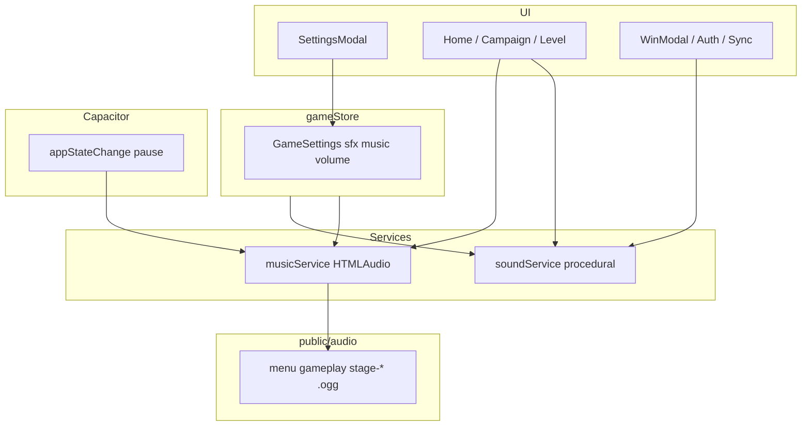

# Roadmap: audio y música ambiente

Plan incremental por **prompts** verificables, alineado con [SOCIAL_FEATURES_ROADMAP.md](./SOCIAL_FEATURES_ROADMAP.md). Cada prompt se ejecuta en el chat (ej. _"Ejecuta el Prompt 9"_), se verifica contigo y solo entonces se pasa al siguiente.

**Estado actual (v1.2.1 en producción):** todos los efectos son **procedurales** (Web Audio API) en [`src/services/soundService.ts`](../src/services/soundService.ts). No hay archivos `.mp3` / `.ogg` en el repo. Configuración: un único toggle `soundEnabled` en Ajustes.

**Prioridad:** el audio va **después del push** (tras Prompt 8 / v1.5.0). No empezar Prompt 9 hasta cerrar notificaciones.

**Documentos relacionados:** [SCRIPTS.md](./SCRIPTS.md) (release) · [CHANGELOG.md](./CHANGELOG.md) · [SOCIAL_FEATURES_ROADMAP.md](./SOCIAL_FEATURES_ROADMAP.md)

---

## Avance general

| Prompt | Versión | Descripción | Estado |
| ------ | ------- | ----------- | ------ |
| [9](#prompt-9--audio-mvp-v160) | **v1.6.0** | SFX ampliados + música ambiente básica + toggles | ⬜ Pendiente _(tras push)_ |
| [10](#prompt-10--ambiente-por-etapa-v161) | **v1.6.1** | Música por etapa + volumen + SFX de sync | ⬜ Pendiente |

**Leyenda:** ⬜ Pendiente · 🔄 En curso · ✅ Completado

> Actualiza la columna Estado manualmente al terminar cada prompt.

---

## Calendario coordinado con otras features

| Versión | Audio (este doc) | Social / otras ([SOCIAL_FEATURES_ROADMAP](./SOCIAL_FEATURES_ROADMAP.md)) |
| ------- | ---------------- | ------------------------------------------------------------------------ |
| **v1.2.1** ✅ | Sin assets (SFX procedural) | Cuenta + sync + retos/medallas — **publicado** |
| **v1.3.0** | — | **Prompt 6** — ranking en vivo |
| **v1.4.0** | — | **Prompt 7** — push «te superaron» |
| **v1.5.0** | — | **Prompt 8** — push engagement ← **código listo; siguiente release** |
| **v1.6.0** | **Prompt 9** — audio MVP ← **siguiente tras v1.5.0** | — |
| **v1.6.1** | **Prompt 10** — ambiente por etapa | — |

> **Nota (2026-07-17):** Audio dejó de intercalarse entre ranking y push. Prompts 9–10 (antes A1/A2) quedan al final: **v1.6.0** / **v1.6.1**.

---

## Principios (no negociables)

- [ ] **Offline-first:** música y SFX deben funcionar sin red (assets embebidos en el APK)
- [ ] **Licencia libre:** solo audio **CC0**, dominio público o royalty-free explícito para empaquetar en APK — sin suscripciones ni royalties
- [ ] **Documentar procedencia:** cada archivo en `docs/AUDIO_CREDITS.md` (fuente, licencia, URL)
- [ ] **Peso controlado:** SFX en código cuando sea posible; solo la música en archivos comprimidos
- [ ] **Separar SFX y música** en Ajustes (el jugador puede querer efectos sin música o viceversa)
- [ ] **Pausa en segundo plano:** al minimizar la app (Capacitor `@capacitor/app`), pausar música
- [ ] El dominio (`src/domain/`) **no importa** servicios de audio

---

## Estado actual del audio

### Implementación

| Aspecto | Ubicación | Detalle |
| ------- | --------- | ------- |
| Servicio SFX | `src/services/soundService.ts` | `AudioContext` + osciladores; sin assets |
| Disparo de sonidos | `src/store/gameStore.ts` | select, deselect, move, error, undo, win |
| Estrellas | `src/components/WinModal.tsx` | `star` (tono aleatorio) |
| Settings | `src/components/SettingsModal.tsx` | Toggle único `soundEnabled` |
| Persistencia | `src/store/gameStore.ts` → `GameSettings` | `soundEnabled: boolean` |

### Tipos de sonido existentes (`SoundType`)

| Tipo | Evento |
| ---- | ------ |
| `select` | Seleccionar bulón |
| `deselect` | Deseleccionar bulón |
| `move` | Movimiento válido |
| `error` | Movimiento inválido, bulón bloqueado, sin deshaceres |
| `undo` | Deshacer |
| `win` | Completar nivel |
| `star` | Animación de estrellas en victoria |

### Sin sonido hoy

- Tap en botones de UI (menú, campaña, modales)
- Reiniciar nivel (`resetLevel`)
- Bulón bloqueado (mismo `error` que movimiento inválido)

### Presupuesto de peso (APK)

| Concepto | Enfoque | Estimación |
| -------- | ------- | ---------- |
| SFX | Procedural (Web Audio) | ~0 MB assets |
| Música menú + partida (Prompt 9) | 1–2 loops **OGG**, mono, 64–96 kbps, 45–90 s | **~0,6–1,6 MB** |
| Música por etapa (Prompt 10) | +3 loops OGG optimizados | **~+1–2 MB** |

---

## Cómo usar este documento

1. Tras publicar **v1.5.0** (Prompt 8 — push engagement), di: **"Ejecuta el Prompt 9"**
2. O copia el bloque **«Texto para copiar en el chat»** de [SOCIAL_FEATURES_ROADMAP.md](./SOCIAL_FEATURES_ROADMAP.md#prompt-9--audio-mvp-v160)
3. Al terminar, marca las checkboxes del prompt
4. Cambia el estado en la tabla de avance (⬜ → ✅) en ambos roadmaps
5. Bump `package.json` → `1.6.0`, `versionCode` 10, scaffold en `release-notes.json`, `npm run release:prepare`
6. Añade fecha en la sección **Historial** al final

---

## Prompt 9 — Audio MVP (v1.6.0)

**Comando en chat:** `Ejecuta el Prompt 9`

**Versión:** v1.6.0 (`versionCode` 10)

**Prerequisito:** Push engagement v1.5.0 publicado (Prompt 8).

**Objetivo:** Ampliar feedback sonoro sin inflar el APK; introducir música ambiente opcional con dos loops.

**Patrón de diseño:** **Strategy** — `musicService` separado de `soundService`; dominio aislado de infra de audio.

### Qué se hace

#### Infraestructura

- [ ] `src/services/musicService.ts` — `HTMLAudioElement`, `loop`, play/pause/stop, volumen
- [ ] Integrar `@capacitor/app` — pausar música en `appStateChange` (background)
- [ ] Ampliar `GameSettings` en `src/domain/types.ts`:
  - `sfxEnabled: boolean` (migrar desde `soundEnabled` o alias)
  - `musicEnabled: boolean`
- [ ] Migración en persist de Zustand: usuarios con `soundEnabled: true` → ambos `true`
- [ ] `SettingsModal`: dos toggles (Sonidos / Música) + textos i18n ES/EN
- [ ] `public/audio/menu.ogg` + `public/audio/gameplay.ogg` (CC0 documentados)
- [ ] `docs/AUDIO_CREDITS.md` — licencias de los loops

#### Música

- [ ] Loop en **Home** y **Campaña** → `menu.ogg`
- [ ] Loop en **partida** (`LevelScreen`) → `gameplay.ogg`
- [ ] Crossfade o fade corto al cambiar pantalla (evitar cortes bruscos)
- [ ] Respetar `musicEnabled`; primer gesto del usuario desbloquea autoplay (política móvil)

#### SFX procedurales nuevos (`soundService.ts`)

Extender `SoundType` y llamadas desde store/UI:

| Nuevo tipo | Dónde disparar | Notas |
| ---------- | -------------- | ----- |
| `uiTap` | Botones principales (opcional: hook o wrapper) | Corto, bajo volumen |
| `modalOpen` / `modalClose` | Settings, Win, WhatsNew | Suave |
| `reset` | `resetLevel` en `gameStore` | Distinto de `undo` |
| `locked` | Bulón bloqueado en `selectBolt` | Metálico; no reutilizar `error` |
| `moveBlock` | Movimiento multi-tuerca | Más grave que `move` |
| `shake` | Al setear `shakeBoltIndex` | Micro-sonido sordo |
| `star1` / `star2` / `star3` | `WinModal` según estrellas ganadas | Reemplazar `star` aleatorio |
| `stageUnlock` | Desbloqueo de etapa (si hay evento en campaña/home) | Fanfarria corta |

#### Refactor menor

- [ ] `soundService.setEnabled` → `setSfxEnabled` (o mantener alias)
- [ ] `toggleSound` → `toggleSfx` + `toggleMusic` en `gameStore`

### Verificación

- [ ] Con música ON: loop en menú; al entrar a nivel cambia a gameplay; al volver, menú
- [ ] Con música OFF: silencio; SFX siguen si funcionan con SFX ON
- [ ] Con SFX OFF: sin efectos; música independiente
- [ ] App a segundo plano → música pausada; al volver → reanuda si `musicEnabled`
- [ ] APK release: tamaño total sube < 2 MB vs build sin audio
- [ ] `docs/AUDIO_CREDITS.md` completo
- [ ] `npm run build` y prueba en dispositivo real (autoplay tras primer tap)
- [ ] `release-notes.json` + `npm run release:prepare` para v1.6.0
- [ ] Revisión contigo antes de Prompt 10

### Highlights sugeridos (modal «Novedades»)

**ES**

- Música de fondo opcional en menú y durante la partida
- Sonidos y música se configuran por separado en Ajustes
- Nuevos efectos: bulones bloqueados, bloques de tuercas, estrellas y más

**EN**

- Optional background music in menu and during levels
- Sound effects and music can be toggled separately in Settings
- New effects: locked bolts, nut blocks, stars, and more

---

## Prompt 10 — Ambiente por etapa (v1.6.1)

**Comando en chat:** `Ejecuta el Prompt 10`

**Versión:** v1.6.1 (`versionCode` 11)

**Prerequisito:** Prompt 9 completado (v1.6.0 publicada).

**Objetivo:** Ambiente distinto por etapa de campaña, control de volumen y SFX de cuenta/sync.

**Patrón de diseño:** **Strategy** — selector de pista por `stageId` sin acoplar el dominio del puzzle.

### Qué se hace

#### Música por etapa

Mapeo sugerido (Campaña *El Taller*):

| Etapa | Niveles | Archivo | Ambiente |
| ----- | ------- | ------- | -------- |
| Caja de herramientas | 1–30 | `public/audio/stage-workshop.ogg` | Taller suave |
| El garaje apretado | 31–60 | `public/audio/stage-garage.ogg` | Industrial ligero |
| La línea de montaje | 61–100 | `public/audio/stage-factory.ogg` | Fábrica / ritmo |

- [ ] `musicService.playForStage(stageId)` o equivalente
- [ ] En partida: pista según etapa del nivel actual
- [ ] En campaña/home: pista según etapa visible o última jugada
- [ ] Crossfade entre pistas al cambiar etapa (~300–500 ms)
- [ ] Actualizar `docs/AUDIO_CREDITS.md`

#### Volumen

- [ ] `GameSettings`: `musicVolume` y `sfxVolume` (0–1) o sliders discretos (bajo / medio / alto)
- [ ] UI en `SettingsModal`
- [ ] Persistencia en Zustand

#### SFX adicionales

| Tipo | Evento |
| ---- | ------ |
| `syncSuccess` | Sync completado tras victoria / login |
| `syncError` | Fallo de sync (sutil, no intrusivo) |

#### Optimización

- [ ] Revisar peso total de `public/audio/` (< 4 MB recomendado)
- [ ] Confirmar mono + OGG 64–96 kbps en todos los loops

### Verificación

- [ ] Nivel 1 → taller; nivel 35 → garaje; nivel 70 → fábrica
- [ ] Cambio de etapa en campaña actualiza música con crossfade
- [ ] Sliders de volumen afectan en tiempo real
- [ ] Sync exitoso/fallido audible solo con SFX ON
- [ ] Sin regresión en toggles de Prompt 9
- [ ] `release-notes.json` + release v1.6.1
- [ ] Revisión contigo → cierre del roadmap de audio

### Highlights sugeridos (modal «Novedades»)

**ES**

- Música distinta para cada etapa del taller
- Control de volumen de música y efectos
- Sonidos al sincronizar tu progreso en la nube

**EN**

- Different music for each workshop stage
- Music and sound effect volume controls
- Sounds when syncing your cloud progress

---

## Arquitectura objetivo (tras Prompt 10)

---

## Riesgos y mitigaciones

| Riesgo | Mitigación |
| ------ | ---------- |
| APK demasiado pesado | SFX procedural; OGG mono; loops cortos; presupuesto < 4 MB audio |
| Autoplay bloqueado en Android | Iniciar música tras primer `pointerdown` / tap del usuario |
| Música + SFX compiten | Volumen música < SFX; ducking opcional al reproducir `win` |
| Licencia incorrecta | Solo CC0/royalty-free; `AUDIO_CREDITS.md` obligatorio |
| Solapamiento push + audio | Push en v1.4.0–v1.5.0; Prompt 9 en v1.6.0 (releases separadas) |
| Usuario legacy solo con `soundEnabled` | Migración en `persist` al hidratar settings |

---

## Historial

| Fecha | Prompt | Notas |
| ----- | ------ | ----- |
| 2026-07-03 | — | Roadmap creado. Decisión original: A1 → v1.2.1, A2 → v1.3.1. |
| 2026-07-16 | — | Replan intermedio: A1 → v1.3.1 tras ranking; A2 → v1.4.1. |
| 2026-07-17 | — | Replan: audio al final como **Prompt 9** (v1.6.0) y **Prompt 10** (v1.6.1); sin A1/A2. Push primero. |

---

## Próximo paso (audio)

**Ahora no:** primero [Prompt 7 — push v1.4.0](./SOCIAL_FEATURES_ROADMAP.md#prompt-7--push-infraestructura--ranking) y [Prompt 8 — engagement v1.5.0](./SOCIAL_FEATURES_ROADMAP.md#prompt-8--push-engagement--contenido).

**Cuando toque audio:** di _"Ejecuta el Prompt 9"_ o pega el texto de [Prompt 9](./SOCIAL_FEATURES_ROADMAP.md#prompt-9--audio-mvp-v160) (v1.6.0).

**Después:** [Prompt 10](./SOCIAL_FEATURES_ROADMAP.md#prompt-10--ambiente-por-etapa-v161) (ambiente v1.6.1).
