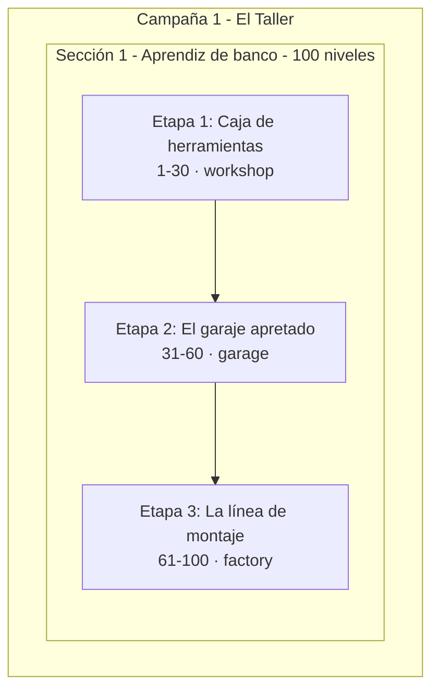
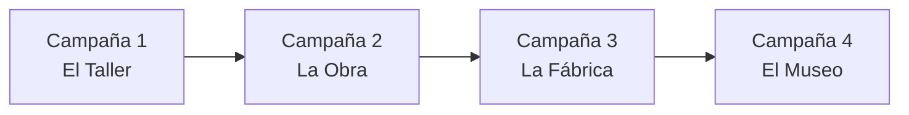

# Arquitectura de contenido — Nuts & Bolts

Contrato estable para organizar niveles, campañas y expansiones futuras.  
La implementación ejecutable vive en `src/domain/content/campaignStructure.ts` (Fase 1+). Este documento es la referencia legible para humanos.

**Documentos relacionados:** [MECHANICS_REGISTRY.md](./MECHANICS_REGISTRY.md) · [CONTENT_CHANGELOG.md](./CONTENT_CHANGELOG.md) · [EXTENSION_PLAYBOOK.md](./EXTENSION_PLAYBOOK.md)

---

## Jerarquía

```
Campaña (600–2000 niveles)
  └── Sección (100–200 niveles)
        └── Etapa (30–40 niveles)
              └── Nivel (1)
```



| Capa        | Tamaño típico | Rol                                                                    |
| ----------- | ------------- | ---------------------------------------------------------------------- |
| **Campaña** | 600–2000      | Bloque temático grande; hito narrativo/visual cada ~1000 niveles       |
| **Sección** | 100–200       | Subdivisión de campaña; puede variar reglas o estética de forma ligera |
| **Etapa**   | 30–40         | Introduce o intensifica **una** mecánica o variación                   |
| **Nivel**   | 1             | Unidad jugable con layout, dificultad y flags opcionales               |

---

## Estado actual (v1.2.0 — Fase 2)

| Métrica              | Valor                                                            |
| -------------------- | ---------------------------------------------------------------- |
| Niveles publicados   | **100** (ids 1–100)                                              |
| Sección 1            | **Completa**                                                     |
| Mecánicas activas    | clásico, multiNut (61+), lockedBolt (81+)                        |
| Organización en UI   | Por etapas (Caja de herramientas / El garaje apretado)           |
| Progreso del jugador | `unlockedLevel` lineal en `localStorage` (`nuts-bolts-progress`) |
| Fuente de niveles    | `src/domain/levels/bakedLevels.ts`                               |
| Metadata ejecutable  | `src/domain/content/campaignStructure.ts`                        |

---

## Lore y nomenclatura

### Premisa

Eres **aprendiz** en el taller de un mecánico retirado. Cada nivel es un cajón, un estante o un banco de trabajo que hay que **ordenar por color** antes de que llegue el siguiente encargo. Avanzas por espacios del taller — de la caja de herramientas al garaje lleno y, más adelante, a la línea de montaje.

### Dos capas de nombre

| Capa                                         | Uso                        | Ejemplo                                          |
| -------------------------------------------- | -------------------------- | ------------------------------------------------ |
| **Nombre jugable** (`name` en metadata)      | UI, hitos, retos           | «El garaje apretado»                             |
| **Nombre de diseño** (`designLabel` en docs) | Planificación de mecánicas | «Escalado paramétrico»                           |
| **Identificador** (`id` slug)                | Código, saves, hornado     | `stage-2-presion` — **no cambiar** tras publicar |

Los slugs técnicos pueden conservar nombres antiguos (`fundamentos`, `presion`); solo cambia lo que ve el jugador.

### Glosario del universo

| Término              | Significado en el juego                      |
| -------------------- | -------------------------------------------- |
| **Bulón**            | Columna donde se apilan tuercas              |
| **Tuerca**           | Pieza de color que se mueve                  |
| **Banco**            | Área de juego; metáfora del banco de trabajo |
| **Encargo**          | Bloque de niveles / etapa                    |
| **Inspección**       | Reto especial (nivel ⚡)                     |
| **Caja**             | Etapa 1 — primer contacto con el puzzle      |
| **Garaje**           | Etapa 2 — menos espacio (1 bulón vacío)      |
| **Línea de montaje** | Etapa 3 — mecánicas avanzadas                |

### Plantillas para nombrar (campañas futuras)

| Rol                | Plantilla            | Ejemplo                                          |
| ------------------ | -------------------- | ------------------------------------------------ |
| Campaña            | Lugar del universo   | El Taller, La Obra, La Fábrica                   |
| Sección (~100 n.)  | Capítulo / arco      | Aprendiz de banco, El mostrador de ferretería    |
| Etapa (~30 n.)     | Escenario + mecánica | Caja de herramientas, Bulones soldados           |
| Reto (cada ~20 n.) | Verbo de oficio      | Inspección, Prueba de torque, Entrega al cliente |

---

## Campaña 1: El Taller

Tema: taller mecánico, tuercas y bulones. Primera campaña del juego.

### Sección 1: Aprendiz de banco (niveles 1–100) — en implementación

Primer arco: del primer día en el taller hasta dominar el banco principal.

| Etapa | id                      | Niveles | Nombre (UI)          | designLabel          | Tema       | Mecánicas                        | Estado               |
| ----- | ----------------------- | ------- | -------------------- | -------------------- | ---------- | -------------------------------- | -------------------- |
| 1     | `stage-1-fundamentos`   | 1–30    | Caja de herramientas | Puzzle clásico       | `workshop` | 1 tuerca/movimiento              | **Publicada**        |
| 2     | `stage-2-presion`       | 31–60   | El garaje apretado   | Escalado paramétrico | `garage`   | Más colores, 1 vacío             | **Publicada**        |
| 3     | `stage-3-nuevas-reglas` | 61–100  | La línea de montaje  | Mecánicas nuevas     | `factory`  | multiNut (61+), lockedBolt (81+) | **Publicada**        |

#### Blurbs (menú principal)

| Etapa | Blurb                                                               |
| ----- | ------------------------------------------------------------------- |
| 1     | Primer día en el taller: ordena la caja del maestro.                |
| 2     | El coche ocupa sitio. Queda poco espacio libre en el banco.         |
| 3     | Encargos grandes: cadenas de tuercas y bulones que hay que liberar. |

#### Retos especiales (Sección 1)

Niveles con `isChallenge: true` en `CHALLENGE_LEVEL_IDS` (20, 40, 60, 80, 100).  
Desde release **1.2.1** aplican **modo reto** (`challengeMode` — ver [MECHANICS_REGISTRY.md](./MECHANICS_REGISTRY.md)).

| Nivel | Nombre jugable         | Tipo                      |
| ----- | ---------------------- | ------------------------- |
| 20    | Inspección de la caja  | Mini-hito Etapa 1         |
| 40    | Prueba de torque       | Reto Etapa 2              |
| 60    | Cierre del garaje      | Cierre Etapa 2            |
| 80    | Control de calidad     | Reto Etapa 3              |
| 100   | Graduación de aprendiz | Cierre Sección 1          |

#### Modo reto — reglas (1.2.1+)

| Resultado | Desbloquea N+1 | Medalla | Icono mapa |
| --------- | -------------- | ------- | ---------- |
| 3 estrellas | Sí | Sí | ✓ verde |
| 1–2 estrellas | Sí | No | ⚡ |
| Sin completar en 3 intentos | No | No | ⚡ + cooldown |

- **Intentos:** mover tuerca o reiniciar = 1 intento; salir sin mover = gratis
- **Regeneración:** 1 intento / 8 h, máx. 3 en reserva; solo bloquea ese reto
- **Sin deshacer** hasta superar con 3★; luego rejuego libre
- **Medallero:** 5 slots en inicio y campaña (`MedalGalleryModal`)
- **Persistencia:** `PlayerProgress.challenges` + migración desde `levels[id]`

#### Curva de dificultad (patrón ola)

Dentro de cada etapa, alternar bloques `easy → medium → hard → easy → …`  
El campo `difficulty` controla undos (`MAX_UNDOS` en `types.ts`) y tono del puzzle.

Ejemplo Etapa 2 (31–60):

- 31–35: easy (transición desde nivel 30)
- 36–42: medium
- 43–48: hard
- 49–52: easy (respiro)
- 53–58: medium → hard
- 59–60: hard + reto 60

---

## Rangos reservados (futuro)

Ids **secuenciales globales**. Nunca reutilizar un id publicado.

### Campaña 1 — El Taller (objetivo ~600 niveles)

| Sección | Niveles | Nombre jugable                | designLabel / mecánicas                    | Notas                                          |
| ------- | ------- | ----------------------------- | ------------------------------------------ | ---------------------------------------------- |
| 1       | 1–100   | Aprendiz de banco             | Clásico → escalado → multiNut + lockedBolt | **En implementación**                          |
| 2       | 101–200 | El mostrador de ferretería    | `variableCapacity`, `fixedColorBolt`       | Atender clientes; bulones de medidas distintas |
| 3       | 201–300 | El almacén trasero            | `hiddenNut`                                | Piezas tapadas bajo otras tuercas              |
| 4       | 301–400 | Proyectos especiales          | Combinaciones                              | Mezcla de mecánicas ya aprendidas              |
| 5       | 401–500 | Temporada alta                | Dificultad + retos                         | Rush de pedidos; `moveLimit` en retos          |
| 6       | 501–600 | El último encargo del maestro | Cierre campaña                             | Boss levels, mezcla total                      |

### Campañas 2+ (borrador)



| Campaña | id slug              | Niveles   | Lugar                | Tono                     | Mecánica distintiva (plan)                   |
| ------- | -------------------- | --------- | -------------------- | ------------------------ | -------------------------------------------- |
| 2       | `campaign-2-obra`    | 601–1200  | Obra en construcción | Polvo, urgencia          | `stickyNut`, bulones altos                   |
| 3       | `campaign-3-fabrica` | 1201–1800 | Planta industrial    | Ritmo, precisión         | `moveLimit` en campaña, colores industriales |
| 4       | `campaign-4-museo`   | 1801+     | Museo de la mecánica | Curiosidad, reglas raras | Variantes retro / limitadas                  |

Al abrir Campaña 2, evaluar `campaignProgress` en save (ver [EXTENSION_PLAYBOOK.md](./EXTENSION_PLAYBOOK.md)).

---

## Convenciones

### Identificadores

- **Nivel:** entero secuencial global (`id` en `LevelDefinition`)
- **Etapa:** `stage-{n}-{slug}` — slug estable; el `name` jugable puede cambiar
- **Sección:** `section-{n}-{slug}` (ej. `section-1-fundamentos`)
- **Campaña:** `campaign-{n}-{slug}` (ej. `campaign-1-taller`)
- **Tema visual:** `workshop` | `garage` | `factory` | (extensible)
- **Retos:** `CHALLENGE_LABELS` en `campaignStructure.ts`

### Temas visuales

- Cambio de paleta/fondo al **inicio de cada etapa** (`levelFrom`)
- Cambio más marcado cada **100 niveles** (inicio de sección)
- Los temas no alteran reglas del puzzle

### Mecánicas

- **Máximo 1 mecánica nueva por etapa**
- Tutorial en los **primeros 4 niveles** de la etapa que la introduce
- Ver catálogo completo en [MECHANICS_REGISTRY.md](./MECHANICS_REGISTRY.md)
- Regla de largo plazo: una mecánica nueva cada **100–150 niveles**

### Progresión

- Campaña principal: desbloqueo lineal (`unlockedLevel`)
- Completar nivel `N` desbloquea `N+1` (si existe)
- Misiones paralelas (diarios, eventos) **no** alteran `unlockedLevel`

### Hornado de niveles

- Niveles publicados: **congelados** — no regenerar layouts
- Niveles nuevos: append en `LEVEL_SPECS` + `bake:levels --from=N`
- Validar siempre: `npm run validate:levels`

---

## Modelo de datos (planificado)

Campos opcionales en `LevelDefinition` — omitidos en niveles 1–30 = comportamiento actual.

```typescript
interface LevelDefinition {
  id: number;
  difficulty: "easy" | "medium" | "hard";
  capacity: number;
  bolts: Bolt[];
  minMoves: number;
  parMoves: number;
  // Fase 1+
  stageId?: string;
  isChallenge?: boolean;
  mechanics?: MechanicId[];
  // Fase 2+
  boltConfigs?: BoltConfig[];
}
```

---

## Reglas de oro

1. Nunca rehornear niveles ya publicados
2. Campos nuevos siempre opcionales con defaults que preservan el puzzle clásico
3. Agrupar por mecánica en etapas, no solo por dificultad
4. Patrón ola de dificultad dentro de cada etapa
5. Reto especial cada ~20 niveles por sección

---

## Historial de este documento

| Fecha      | Cambio                                                                                         |
| ---------- | ---------------------------------------------------------------------------------------------- |
| 2026-06-26 | Nomenclatura jugable (lore del taller): secciones, etapas, retos y glosario. Slugs sin cambio. |
| 2026-06-26 | Creación inicial (Fase 0). Estado: 30 niveles publicados, roadmap 31–100.                      |
