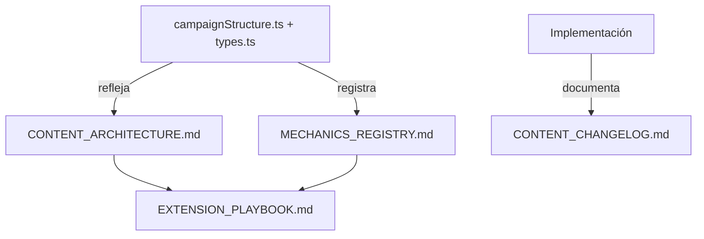

# Playbook de extensión — Nuts & Bolts

Checklists reutilizables para añadir niveles, mecánicas, secciones o campañas **sin romper el progreso de jugadores existentes**.

**Documentos relacionados:** [CONTENT_ARCHITECTURE.md](./CONTENT_ARCHITECTURE.md) · [MECHANICS_REGISTRY.md](./MECHANICS_REGISTRY.md) · [CONTENT_CHANGELOG.md](./CONTENT_CHANGELOG.md)

---

## Reglas de oro (inmutables)

1. **Nunca rehornear** niveles ya publicados — invalida estrellas guardadas
2. **Campos nuevos opcionales** con defaults que preservan el puzzle clásico
3. **Agrupar por mecánica** en etapas, no solo por dificultad
4. **Patrón ola** de dificultad dentro de cada etapa (easy → medium → hard → respiro)
5. **Reto especial** cada ~20 niveles por sección (20, 40, 60…)
6. **Ids secuenciales globales** — nunca reutilizar un id de nivel
7. **Append-only** al hornear: solo generar ids nuevos

---

## Checklist: añadir niveles a una sección existente

Usar cuando se agregan niveles dentro de una sección ya definida (ej. 31–60 en Sección 1).

- [ ] Confirmar rango de ids libres en [CONTENT_ARCHITECTURE.md](./CONTENT_ARCHITECTURE.md)
- [ ] Si la etapa supera ~40 niveles, crear **nueva etapa** en metadata
- [ ] Añadir specs **solo para ids nuevos** en `src/domain/levelGenerator.ts` (`LEVEL_SPECS`)
- [ ] Asignar `difficulty` siguiendo patrón ola de la etapa
- [ ] Marcar retos con `isChallenge: true` en metadata (Fase 1+)
- [ ] Hornear con append: `npm run bake:levels` (flag `--from=N` cuando exista)
- [ ] Verificar que ids 1–30 (u otros publicados) no cambiaron — checksum de `bolts`
- [ ] Ejecutar `npm run validate:levels`
- [ ] Probar save con `unlockedLevel` en el primer nivel nuevo
- [ ] Actualizar [CONTENT_CHANGELOG.md](./CONTENT_CHANGELOG.md)
- [ ] Actualizar rangos en [CONTENT_ARCHITECTURE.md](./CONTENT_ARCHITECTURE.md) si aplica

### Comandos

```bash
npm run bake:levels      # tras añadir specs (append-only en Fase 1+)
npm run validate:levels  # debe pasar sin errores
```

---

## Checklist: añadir una mecánica nueva

Usar antes de escribir código del motor.

- [ ] Registrar en [MECHANICS_REGISTRY.md](./MECHANICS_REGISTRY.md) con estado `planificada`
- [ ] Definir en qué **etapa** se introduce (máximo 1 mecánica nueva por etapa)
- [ ] Planificar **3–4 niveles tutorial** al inicio de esa etapa
- [ ] Extender `MechanicId` en `src/domain/types.ts` (comentario → enlace al registro)
- [ ] Añadir campos opcionales a `LevelDefinition` / `BoltConfig` si hace falta
- [ ] Implementar reglas en `src/domain/gameEngine.ts`
- [ ] Extender BFS en `src/domain/levelValidator.ts` si la mecánica añade estado
- [ ] UI mínima: `BoltStack`, `NutPiece` y/o coach mark
- [ ] **Globo de ayuda (obligatorio):** registrar nivel intro en `src/config/mechanicOnboarding.ts`, crear `{Mechanic}CoachMark.tsx`, `{mechanic}OnboardingService.ts`, claves i18n `level.coach{Mechanic}` y conectar en `useMechanicCoachMarks.ts`
- [ ] Inicializar estado en `gameStore.createSessionFromLevel`
- [ ] Crear niveles de tutorial + práctica + reto con la mecánica
- [ ] `npm run validate:levels`
- [ ] Marcar mecánica como `activa` en el registro
- [ ] Actualizar changelog y arquitectura

### Punto de extensión principal

El validador BFS delega en `canMove` + `moveNuts`. Extender esas funciones suele ser suficiente para que generación y validación sigan funcionando.

---

## Checklist: añadir una sección nueva

Ejemplo: Sección 2, niveles 101–200.

- [ ] Reservar rango en [CONTENT_ARCHITECTURE.md](./CONTENT_ARCHITECTURE.md)
- [ ] Definir **nombre jugable**, `designLabel` (docs) y mecánica protagonista — ver «Lore y nomenclatura»
- [ ] Añadir entrada en `src/domain/content/campaignStructure.ts` (`name`, `blurb`, retos en `CHALLENGE_LABELS`)
- [ ] Crear 2–4 etapas de 30–40 niveles cada una
- [ ] Nuevo `themeId` para CSS (Home + LevelScreen)
- [ ] Hito narrativo al completar el último nivel de la sección anterior (ej. 100 → 101)
- [ ] **No migrar saves** si se mantiene `unlockedLevel` lineal
- [ ] Actualizar los cuatro documentos de `docs/`

---

## Checklist: añadir una campaña nueva

Para expansiones grandes (600+ niveles, ids 601+ o salto de bloque).

- [ ] Documentar decisión: ¿`unlockedLevel` lineal alcanza o hace falta `campaignProgress`?
- [ ] Si cambia el esquema de save → implementar `migrate` en Zustand persist + versionar
- [ ] Nueva entrada de campaña en metadata
- [ ] Posible pantalla de selección de campaña (UI nueva)
- [ ] Temática visual y mecánicas propias de la campaña
- [ ] Actualizar playbook con lecciones de la migración

---

## Checklist: release de contenido

Antes de publicar una fase (web / Play Store).

- [ ] `npm run validate:levels` — 0 errores
- [ ] `npm run build` — compila sin errores
- [ ] Probar jugador nuevo (nivel 1)
- [ ] Probar jugador que completó niveles previos (`unlockedLevel` justo después del último publicado)
- [ ] Verificar que estrellas de niveles viejos siguen mostrándose
- [ ] Changelog actualizado con versión y fecha
- [ ] Mecánicas nuevas marcadas `activa` en registro

---

## Compatibilidad de progreso

| Escenario | Comportamiento esperado |
|-----------|-------------------------|
| Jugador en nivel 15, se publican 31–60 | Sigue en 15; 31+ bloqueados hasta avanzar |
| Jugador completó 30 (`unlockedLevel: 31`) | Acceso inmediato al 31 |
| Jugador completó 30, mensaje «todo completado» | Desaparece al haber más niveles; botón «Jugar Nivel 31» |
| Rehornear nivel 5 por error | Estrellas del nivel 5 ya no reflejan el puzzle — **evitar** |
| Nuevo campo en `LevelProgress` | Requiere `migrate` en persist o campo opcional |

Save actual (`localStorage`, clave `nuts-bolts-progress`):

```json
{
  "state": {
    "progress": {
      "unlockedLevel": 31,
      "levels": { "1": { "stars": 3, "bestMoves": 4, "completed": true } }
    },
    "settings": { "soundEnabled": true }
  }
}
```

---

## Relación código ↔ documentación



| Fuente | Rol |
|--------|-----|
| `campaignStructure.ts` | Verdad ejecutable (runtime) |
| `docs/*.md` | Verdad legible (humanos + decisiones) |
| `types.ts` (`MechanicId`) | Comentarios con enlace al registro |

Cada PR de contenido debe incluir actualización del changelog.

---

## Próximos pasos (tras Fase 0)

1. **Fase 1:** implementar `campaignStructure.ts` alineado con [CONTENT_ARCHITECTURE.md](./CONTENT_ARCHITECTURE.md)
2. Refinar este playbook tras la primera expansión real (lecciones de bake append-only)
3. **Fase 2:** añadir sección «Compatibilidad con mecánicas compuestas» si multiNut + lockedBolt requieren casos edge documentados

---

## Historial de este documento

| Fecha | Cambio |
|-------|--------|
| 2026-06-26 | Creación inicial (Fase 0). Checklists base. |
