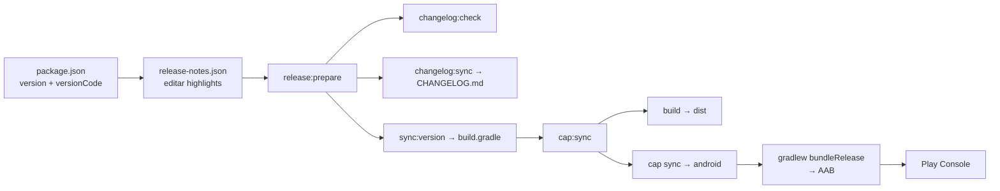

# Scripts npm — Nuts & Bolts

Referencia de todos los comandos definidos en `package.json`, agrupados por cuándo los usas.

---

## Flujo de cada nueva versión (Play Store)

Checklist en orden. Solo necesitas estos pasos habituales:

| Paso | Qué hacer                                                                                                                                |
| ---- | ---------------------------------------------------------------------------------------------------------------------------------------- |
| 1    | Editar `package.json`: subir `version` (semver) y `versionCode` (entero, **siempre mayor** que el anterior)                              |
| 2    | Si es versión nueva: `npm run changelog:scaffold` y completar `src/data/release-notes.json` (`highlights`, secciones, `published: true`) |
| 3    | `npm run release:prepare` — valida notas, regenera `docs/CHANGELOG.md` y sincroniza versión Android                                      |
| 4    | `npm run cap:sync` — compila la web y copia assets al proyecto Android                                                                   |
| 5    | Generar AAB (Android Studio o `cd android && ./gradlew bundleRelease`)                                                                   |
| 6    | Subir AAB a Play Console; copiar los `highlights` (ES) del changelog a las notas de la versión                                           |

```bash
# Resumen en 3 comandos tras editar package.json y release-notes.json
npm run release:prepare
npm run cap:sync
cd android && ./gradlew bundleRelease
```

Para abrir Android Studio después del sync: `npm run cap:android` (equivale a `cap:sync` + abrir IDE).

---

## Scripts del flujo de release

| Comando                      | Qué hace                                                                                                                                                      |
| ---------------------------- | ------------------------------------------------------------------------------------------------------------------------------------------------------------- |
| `npm run release:prepare`    | **Meta-comando de release.** Ejecuta en cadena: `changelog:check` → `changelog:sync` → `sync:version`. Úsalo siempre antes de compilar el AAB.                |
| `npm run changelog:check`    | Comprueba que `package.json` tenga una entrada en `release-notes.json` con `published: true` y `versionCode` coincidente. Falla si falta o no está publicada. |
| `npm run changelog:sync`     | Regenera `docs/CHANGELOG.md` desde `src/data/release-notes.json` (fuente de verdad del modal «Novedades»).                                                    |
| `npm run changelog:scaffold` | Crea una plantilla en `release-notes.json` para la versión actual de `package.json` si aún no existe.                                                         |
| `npm run sync:version`       | Copia `version` y `versionCode` de `package.json` a `android/app/build.gradle` (`versionName` / `versionCode`).                                               |
| `npm run build`              | TypeScript (`tsc -b`) + bundle de producción con Vite → `dist/`.                                                                                              |
| `npm run cap:sync`           | `sync:version` + `build` + `npx cap sync` (web compilada → carpeta `android/`).                                                                               |
| `npm run cap:android`        | `cap:sync` + abre el proyecto en Android Studio.                                                                                                              |

**Fuente única de versión:** solo editas `package.json`. El resto se propaga con estos scripts.

**Documentación relacionada:** [PLAYSTORE.md](./PLAYSTORE.md) · [CHANGELOG.md](./CHANGELOG.md) · [AUDIO_ROADMAP.md](./AUDIO_ROADMAP.md) (A1 v1.3.1 / A2 v1.4.1) · [SOCIAL_FEATURES_ROADMAP.md](./SOCIAL_FEATURES_ROADMAP.md) (siguiente: ranking v1.3.0)

---

## Desarrollo local (día a día)

| Comando           | Qué hace                                                                          |
| ----------------- | --------------------------------------------------------------------------------- |
| `npm run dev`     | Servidor de desarrollo Vite con hot reload.                                       |
| `npm run preview` | Sirve el build de producción localmente (para probar `dist/` antes de Capacitor). |

---

## Uso eventual

### Contenido y niveles

| Comando                    | Cuándo usarlo                                                                                                                                     |
| -------------------------- | ------------------------------------------------------------------------------------------------------------------------------------------------- |
| `npm run bake:levels`      | Regenera los niveles hornados en código a partir de `LEVEL_SPECS`. Tras añadir niveles nuevos. Opción append: `npm run bake:levels -- --from=31`. |
| `npm run validate:levels`  | Valida solubilidad, calidad y duplicados de todos los niveles. Obligatorio tras hornear o cambiar specs.                                          |
| `npm run validate:locales` | Comprueba que `es.json` y `en.json` tengan las mismas claves i18n.                                                                                |

Ver [EXTENSION_PLAYBOOK.md](./EXTENSION_PLAYBOOK.md) y [CONTENT_CHANGELOG.md](./CONTENT_CHANGELOG.md).

### Tests

| Comando                 | Cuándo usarlo                                                                                                             |
| ----------------------- | ------------------------------------------------------------------------------------------------------------------------- |
| `npm test`              | Tests unitarios (Vitest, una pasada).                                                                                     |
| `npm run test:watch`    | Vitest en modo watch durante desarrollo.                                                                                  |
| `npm run test:supabase` | Prueba manual de login y upsert contra Supabase. Requiere `.env.local`. Uso: `npm run test:supabase -- email contraseña`. |

### Assets y diseño

| Comando                  | Cuándo usarlo                                                                                              |
| ------------------------ | ---------------------------------------------------------------------------------------------------------- |
| `npm run generate:icons` | Regenera iconos Android desde el splash (Python + `@capacitor/assets`). Solo al cambiar branding o splash. |

---

## Diagrama del flujo de release



---

## Resumen rápido

| Frecuencia                | Comandos clave                             |
| ------------------------- | ------------------------------------------ |
| **Cada release**          | `release:prepare` → `cap:sync` → build AAB |
| **Cada día**              | `dev`                                      |
| **Al ampliar niveles**    | `bake:levels` → `validate:levels`          |
| **Al tocar traducciones** | `validate:locales`                         |
| **Al cambiar iconos**     | `generate:icons`                           |
| **Al probar backend**     | `test:supabase`                            |
