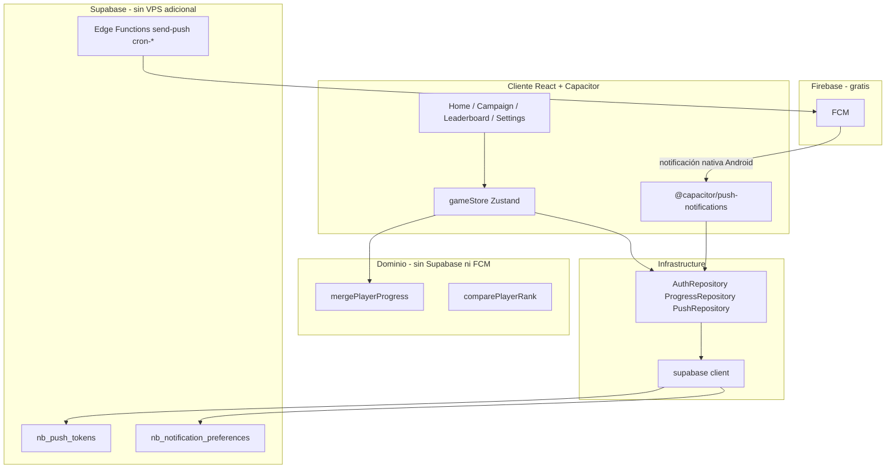

# Roadmap: funciones sociales y ranking

Plan incremental por **prompts** verificables. Cada prompt se ejecuta en el chat (ej. _"Ejecuta el Prompt 0"_), se verifica contigo y solo entonces se pasa al siguiente.

**Documentos relacionados:** [BACKEND_DECISION.md](./BACKEND_DECISION.md) · [MIGRATION_PLAYBOOK.md](./MIGRATION_PLAYBOOK.md) _(se crea en Prompt 5)_ · [EXTENSION_PLAYBOOK.md](./EXTENSION_PLAYBOOK.md) · [PRIVACY_POLICY.md](./PRIVACY_POLICY.md) _(actualizar en Prompts 7–8)_ · [AUDIO_ROADMAP.md](./AUDIO_ROADMAP.md) _(v1.2.1 / v1.3.1)_

---

## Avance general

| Prompt                                      | Versión | Descripción                               | Estado        |
| ------------------------------------------- | ------- | ----------------------------------------- | ------------- |
| [0](#prompt-0--dominio-puro)                | —       | Merge + ranking 6 criterios (sin backend) | ✅ Completado |
| [1](#prompt-1--backend-supabase)            | —       | Proyecto Supabase + esquema SQL + RLS     | ✅ Completado |
| [2](#prompt-2--capa-infrastructure)         | —       | SDK + repositories (sin UI)               | ✅ Completado |
| [3](#prompt-3--sync-offline-first)          | v1.2.0  | Sync al ganar nivel                       | ✅ Completado |
| [4](#prompt-4--ui-de-cuenta)                | v1.2.0  | Auth + Google OAuth                       | ✅ Completado |
| [5](#prompt-5--release-v120--migración-beta) | v1.2.0  | QA + Play Store + jugadores beta          | ⬜ Pendiente  |
| [A1](#prompt-a1--audio-mvp-v121) | v1.2.1  | Audio MVP: SFX ampliados + música + toggles | ⬜ Pendiente  |
| [6](#prompt-6--ranking-realtime)            | v1.3.0  | Leaderboard en vivo                       | ⬜ Pendiente  |
| [7](#prompt-7--push-infraestructura--ranking) | v1.3.1 | FCM + tokens + push «te superaron»        | ⬜ Pendiente  |
| [A2](#prompt-a2--ambiente-por-etapa-v131) | v1.3.1  | Ambiente por etapa + volumen + SFX sync   | ⬜ Pendiente  |
| [8](#prompt-8--push-engagement--contenido)  | v1.4.0  | Re-engagement, updates, racha, hitos      | ⬜ Pendiente  |

**Leyenda:** ⬜ Pendiente · 🔄 En curso · ✅ Completado

> Actualiza la columna Estado manualmente al terminar cada prompt.

---

## Principios (no negociables)

- [ ] El juego sigue **offline-first**; la nube es backup + ranking opcional
- [ ] `localStorage` (`nuts-bolts-progress`) es la fuente de verdad **durante la partida**
- [ ] Los ~20 jugadores beta **no pierden progreso** al actualizar
- [ ] El dominio (`src/domain/`) **no importa** SDK de Supabase ni ningún backend
- [ ] Ranking público solo con **opt-in** (`show_in_leaderboard`, default off)
- [ ] Notificaciones push solo con **opt-in** explícito (permiso Android + toggles por categoría)
- [ ] Push personalizadas requieren **cuenta vinculada** (sin cuenta: no hay token en servidor)

### Regla de merge (dominio puro)

```typescript
stars = max(local, remoto);
bestMoves = min(local, remoto); // si ambos > 0
completed = local || remoto;
unlockedLevel = max(local, remoto);
```

---

## Decisiones tomadas

| Decisión          | Elección                                                 | Documento                                                                |
| ----------------- | -------------------------------------------------------- | ------------------------------------------------------------------------ |
| Backend           | **Supabase**                                             | [BACKEND_DECISION.md](./BACKEND_DECISION.md)                             |
| Auth (proveedor)  | **Supabase Auth**                                        | [BACKEND_DECISION.md](./BACKEND_DECISION.md#autenticación-supabase-auth) |
| Login principal   | **Google**                                               | Prompt 4                                                                 |
| Login alternativo | **Email + contraseña**                                   | Prompt 4                                                                 |
| Facebook          | No en v1.2 (v1.4+ si hay demanda)                        | [BACKEND_DECISION.md](./BACKEND_DECISION.md#autenticación-supabase-auth) |
| Ranking público   | Opt-in (`show_in_leaderboard`, default off)              | Prompt 6                                                                 |
| Push notifications | **FCM** (Firebase Cloud Messaging) vía Capacitor        | [Prompt 7](#prompt-7--push-infraestructura--ranking)                     |
| Envío de push     | Supabase Edge Functions (sin servidor adicional)         | Prompt 7–8                                                               |
| Orden del ranking | 6 criterios — ver [RANKING_RULES.md](./RANKING_RULES.md) | Prompt 0                                                                 |
| Releases          | v1.2.0 = cuenta + sync; **v1.2.1 = audio MVP** ([AUDIO_ROADMAP](./AUDIO_ROADMAP.md) A1); v1.3.0 = ranking; v1.3.1 = push ranking + **ambiente por etapa** (A2); v1.4.0 = push engagement | — |

---

## Cómo usar este documento

1. Di en el chat: **"Ejecuta el Prompt N"**
2. Al terminar, marca las checkboxes del prompt
3. Cambia el estado en la tabla de avance (⬜ → ✅)
4. Añade fecha en la sección **Historial** al final

---

## Prompt 0 — Dominio puro

**Comando en chat:** `Ejecuta el Prompt 0`

**Objetivo:** Lógica de merge y score sin red, sin UI, sin tocar `gameStore`.

### Qué se hace

- [x] `src/domain/progress/mergePlayerProgress.ts`
- [x] `src/domain/progress/playerRanking.ts` — `comparePlayerRank`, `deriveRankingStats`, `computeRankingPointsThrough3`, `shouldUpdateRankSnapshot`, `hasRankingStatsChanged`
- [x] Tipos en `src/domain/types.ts`: `PlayerRankingMeta`, `PlayerRankingEntry`
- [x] Tests unitarios merge + ranking (`mergePlayerProgress.test.ts`, `playerRanking.test.ts`)
- [x] Barrel `src/domain/progress/index.ts`
- [x] Reglas documentadas en [RANKING_RULES.md](./RANKING_RULES.md) (6 criterios lexicográficos; snapshot al subir `unlockedLevel`)

### Qué NO se hace

- [ ] ~~Backend / Supabase~~
- [ ] ~~Auth / pantallas nuevas~~
- [ ] ~~Cambios en `gameStore`~~

### Verificación

- [x] `npm run build` sin errores
- [x] Tests cubren: local mejor, remoto mejor, empate, nivel parcial, desempates 1→6
- [x] Revisión contigo antes de Prompt 1

### Entregable

Funciones de dominio probadas + [RANKING_RULES.md](./RANKING_RULES.md); listas para esquema Supabase (Prompt 1).

---

## Prompt 1 — Backend Supabase

**Comando en chat:** `Ejecuta el Prompt 1`

**Prerequisito:** Proyecto creado en [supabase.com](https://supabase.com) con URL + anon key.

**Objetivo:** Esquema de BD y permisos. **Sin integrar SDK en la app aún.**

### Qué se hace

- [x] Proyecto Supabase compartido (`games`) — URL + anon key en `.env.local`
- [x] Tablas: `nb_player_profiles`, `nb_player_progress`, `nb_leaderboard_events`
- [x] Columna `game_id` en todas las tablas (PK compuesta en profiles/progress)
- [x] Columnas de ranking en `nb_player_progress` — ver [RANKING_RULES.md](./RANKING_RULES.md#columnas-en-supabase-prompt-1--6):
      `completed_levels`, `total_stars`, `weighted_tier_points`, `moves_tiebreak_key`, `total_best_moves`, `rank_snapshot_at`
- [x] Payload JSON `levels` + `unlocked_level` (equivalente a `PlayerProgress` local)
- [x] Row Level Security (RLS): cada usuario solo escribe su fila; lectura pública del ranking solo con `show_in_leaderboard = true` en el mismo `game_id`
- [x] Activar **Email** provider en Supabase Dashboard (Google se configura en Prompt 4)
- [x] `.env.example` con:
  ```
  VITE_SUPABASE_URL=
  VITE_SUPABASE_ANON_KEY=
  VITE_GAME_ID=nuts-and-bolts
  VITE_FEATURE_CLOUD_SYNC=true
  VITE_FEATURE_LEADERBOARD=false
  ```
- [x] SQL guardado en `docs/supabase/schema.sql` (aplicar en SQL Editor del dashboard)
- [x] `src/config/game.ts` — `GAME_ID`, nombres de tablas para Prompt 2

### Qué NO se hace

- [ ] ~~`npm install @supabase/supabase-js` en la app~~
- [ ] ~~Cambios en componentes React~~

### Verificación

- [x] Tablas visibles en Supabase Dashboard
- [x] Usuario A no puede escribir progreso de usuario B (RLS en `schema.sql`)
- [x] Revisión contigo antes de Prompt 2

---

## Prompt 2 — Capa infrastructure

**Comando en chat:** `Ejecuta el Prompt 2`

**Objetivo:** Cliente Supabase + repositories detrás de interfaces. Sin UI visible.

### Qué se hace

- [x] `src/infrastructure/contracts/` — `AuthRepository`, `ProgressRepository`
- [x] `src/infrastructure/supabase/` — client, auth, progress (tablas `nb_*`, filtro `game_id`)
- [x] `@supabase/supabase-js` en `package.json`
- [x] Restaurar sesión al arranque (`getSession`) sin modales — `main.tsx` + `authSession.ts`
- [x] `buildMovesTiebreakKey` en dominio (columna `moves_tiebreak_key`)
- [x] Script `npm run test:supabase` — login/registro + upsert de prueba

### Verificación

- [x] Login de prueba (script `scripts/test-supabase.ts`)
- [x] Upsert de `PlayerProgress` de prueba en BD
- [x] Revisión contigo antes de Prompt 3

---

## Prompt 3 — Sync offline-first

**Comando en chat:** `Ejecuta el Prompt 3`

**Objetivo:** Sincronizar progreso al ganar nivel; merge al iniciar sesión.

### Qué se hace

- [x] `src/application/syncProgress.ts`
- [x] Suscripción en `gameStore` post-victoria vía `initProgressSync` (debounced 800 ms, retry en `online`)
- [x] Usar `hasRankingStatsChanged` para decidir upsert; `shouldUpdateRankSnapshot` para `rank_snapshot_at`
- [x] Merge automático local ↔ remoto al detectar sesión (`mergePlayerProgress`)
- [x] `replaceProgress` en `gameStore` para aplicar merge sin re-sync
- [x] Tests unitarios `syncProgress.test.ts`

### Verificación

- [x] `npm run build` y `npm test` sin errores
- [ ] Completar nivel offline → sync al reconectar (manual en dispositivo)
- [ ] Simular beta con 30+ niveles locales + login → merge correcto (manual en dispositivo)
- [x] Jugador sin cuenta sigue igual que antes (`createInfrastructure()` null si no hay flags)
- [x] Revisión contigo antes de Prompt 4

---

## Prompt 4 — UI de cuenta

**Comando en chat:** `Ejecuta el Prompt 4`

**Objetivo:** Pantallas de auth y vinculación de progreso. Google OAuth en Capacitor.

### Qué se hace

- [x] `AuthModal` — Google + email opcional
- [x] `LinkProgressModal` — one-time si `unlockedLevel > 5`
- [x] Botón "Cuenta" en Home / Settings
- [x] Deep link OAuth Android (`com.nutsandbolts.puzzle://`)
- [x] Google OAuth configurado en Supabase + Google Cloud Console (guía en `docs/supabase/README.md`)

### Verificación

- [x] Flujo completo en emulador o dispositivo real (requiere credenciales Google en Supabase)
- [x] 50 niveles locales → Google → sigue en nivel 50 con estrellas intactas (manual)
- [x] Cerrar sesión: progreso local permanece (lógica: `signOut` no toca `gameStore` / `localStorage`)
- [x] Revisión contigo antes de Prompt 5

---

## Prompt 5 — Release v1.2.0 + migración beta

**Comando en chat:** `Ejecuta el Prompt 5`

**Objetivo:** Publicar v1.2.0 en Play Store sin perder saves de los ~20 beta.

### Qué se hace

- [ ] [MIGRATION_PLAYBOOK.md](./MIGRATION_PLAYBOOK.md) — comunicación y planes A/B/C
- [ ] Export manual de save (plan B para soporte)
- [x] Bump versión en `package.json` / Android (`1.2.0`, `versionCode` 3)
- [ ] Actualizar `src/data/release-notes.json` y ejecutar `npm run release:prepare`
- [ ] Copiar `highlights` de v1.2.0 a notas de Play Console
- [ ] Checklist QA completo
- [ ] `npm run release:prepare` — validar `release-notes.json` y regenerar [CHANGELOG.md](./CHANGELOG.md)

### Checklist QA v1.2.0

- [ ] Jugador nuevo sin cuenta: juega normal
- [ ] Jugador con 30+ niveles sin cuenta: actualiza, sigue igual
- [ ] Jugador vincula Google: merge correcto
- [ ] Sin red: juega offline; sync al volver
- [ ] Tras actualizar a v1.2.0: aparece modal «Novedades» una sola vez
- [ ] `npm run validate:levels` y `npm run build` OK
- [ ] Modal «Novedades» (v1.2.0) probado tras actualizar desde beta

### Verificación

- [ ] Mensaje enviado a jugadores beta (WhatsApp/email)
- [ ] AAB subido a Play Store (o listo para subir)
- [ ] Revisión contigo antes de Prompt 6

---

## Prompt A1 — Audio MVP (v1.2.1)

**Comando en chat:** `Ejecuta el Prompt A1`

**Versión:** v1.2.1 (`versionCode` 4)

**Prerequisito:** Prompt 5 completado (v1.2.0 publicada o lista para publicar).

**Objetivo:** Ampliar feedback sonoro sin inflar el APK; introducir música ambiente opcional con dos loops. Detalle ampliado en [AUDIO_ROADMAP.md](./AUDIO_ROADMAP.md).

**Patrón de diseño:** **Strategy** — `musicService` separado de `soundService`; dominio aislado de infra de audio.

### Texto para copiar en el chat

```text
Ejecuta el Prompt A1 (docs/SOCIAL_FEATURES_ROADMAP.md) — Audio MVP v1.2.1.

Contexto: hoy los SFX son procedurales en src/services/soundService.ts; no hay archivos de audio. Solo existe soundEnabled en Settings.

Implementa:
1. musicService (HTMLAudioElement, loop, volumen) + pausa en background con @capacitor/app
2. GameSettings: sfxEnabled + musicEnabled (migrar desde soundEnabled en persist)
3. SettingsModal: dos toggles Sonidos / Música + i18n ES/EN
4. public/audio/menu.ogg + gameplay.ogg (CC0) + docs/AUDIO_CREDITS.md
5. Música: menu en Home/Campaña; gameplay en LevelScreen; crossfade al cambiar pantalla
6. SFX procedurales nuevos en soundService: uiTap, modalOpen, modalClose, reset, locked, moveBlock, shake, star1/2/3, stageUnlock
7. gameStore: toggleSfx + toggleMusic; disparar locked/moveBlock/reset donde corresponda
8. Bump package.json → 1.2.1, versionCode 4, release-notes.json, npm run release:prepare

Principios: offline-first, solo audio CC0/royalty-free, SFX procedural cuando sea posible, peso audio < 2 MB, dominio sin imports de audio.

Verifica en dispositivo real (autoplay tras primer tap). Marca checkboxes del roadmap. Revisión conmigo antes de Prompt A2.
```

### Qué se hace

#### Infraestructura

- [ ] `src/services/musicService.ts` — `HTMLAudioElement`, `loop`, play/pause/stop, volumen
- [ ] Integrar `@capacitor/app` — pausar música en `appStateChange` (background)
- [ ] Ampliar `GameSettings` en `src/domain/types.ts`:
  - `sfxEnabled: boolean` (migrar desde `soundEnabled` o alias)
  - `musicEnabled: boolean`
- [ ] Migración en persist de Zustand: usuarios con `soundEnabled: true` → ambos `true`
- [ ] `SettingsModal`: dos toggles (Sonidos / Música) + textos i18n ES/EN
- [ ] `public/audio/menu.ogg` + `public/audio/gameplay.ogg` (CC0 documentados)
- [ ] `docs/AUDIO_CREDITS.md` — licencias de los loops

#### Música

- [ ] Loop en **Home** y **Campaña** → `menu.ogg`
- [ ] Loop en **partida** (`LevelScreen`) → `gameplay.ogg`
- [ ] Crossfade o fade corto al cambiar pantalla (evitar cortes bruscos)
- [ ] Respetar `musicEnabled`; primer gesto del usuario desbloquea autoplay (política móvil)

#### SFX procedurales nuevos (`soundService.ts`)

| Nuevo tipo | Dónde disparar | Notas |
| ---------- | -------------- | ----- |
| `uiTap` | Botones principales | Corto, bajo volumen |
| `modalOpen` / `modalClose` | Settings, Win, WhatsNew | Suave |
| `reset` | `resetLevel` en `gameStore` | Distinto de `undo` |
| `locked` | Bulón bloqueado en `selectBolt` | Metálico; no reutilizar `error` |
| `moveBlock` | Movimiento multi-tuerca | Más grave que `move` |
| `shake` | Al setear `shakeBoltIndex` | Micro-sonido sordo |
| `star1` / `star2` / `star3` | `WinModal` según estrellas | Reemplazar `star` aleatorio |
| `stageUnlock` | Desbloqueo de etapa en campaña/home | Fanfarria corta |

#### Refactor menor

- [ ] `soundService.setEnabled` → `setSfxEnabled` (o mantener alias)
- [ ] `toggleSound` → `toggleSfx` + `toggleMusic` en `gameStore`

### Qué NO se hace (Prompt A1)

- [ ] ~~Música distinta por etapa~~ → Prompt A2
- [ ] ~~Sliders de volumen~~ → Prompt A2
- [ ] ~~SFX de sync en la nube~~ → Prompt A2

### Verificación

- [ ] Con música ON: loop en menú; al entrar a nivel cambia a gameplay; al volver, menú
- [ ] Con música OFF: silencio; SFX siguen si funcionan con SFX ON
- [ ] Con SFX OFF: sin efectos; música independiente
- [ ] App a segundo plano → música pausada; al volver → reanuda si `musicEnabled`
- [ ] APK release: tamaño total sube < 2 MB vs build sin audio
- [ ] `docs/AUDIO_CREDITS.md` completo
- [ ] `npm run build` y prueba en dispositivo real (autoplay tras primer tap)
- [ ] `release-notes.json` + `npm run release:prepare` para v1.2.1
- [ ] Revisión contigo antes de Prompt A2

### Highlights sugeridos (modal «Novedades»)

**ES:** Música de fondo opcional · Sonidos y música por separado en Ajustes · Nuevos efectos (bulones bloqueados, bloques, estrellas…)

**EN:** Optional background music · Separate sound/music toggles · New effects (locked bolts, blocks, stars…)

### Entregable

`musicService` + SFX ampliados + settings duales + 2 loops OGG documentados; release v1.2.1 lista.

---

## Prompt 6 — Ranking realtime

**Comando en chat:** `Ejecuta el Prompt 6`

**Versión:** v1.3.0 (release separada de v1.2.0)

**Objetivo:** Ranking global con actualizaciones en tiempo real.

### Qué se hace

- [ ] Supabase Realtime en `player_progress` / `leaderboard_events`
- [ ] `LeaderboardScreen` — top jugadores, posición propia
- [ ] Toggle opt-in "Aparecer en el ranking" (default off)
- [ ] Badge en Home con posición
- [ ] Feed reciente (últimos eventos)
- [ ] Columna `last_played_at` en `nb_player_profiles` (o `nb_player_progress`) — alimenta re-engagement en Prompt 8
- [ ] Hook en eventos `rank_up` de `nb_leaderboard_events` — punto de enganche para push en Prompt 7

### Verificación

- [ ] Dos dispositivos: uno completa nivel → otro ve cambio en <3 s
- [ ] Jugador sin opt-in no aparece en ranking
- [ ] Offline: último snapshot cacheado
- [ ] Revisión contigo → release v1.3.0

---

## Prompt 7 — Push: infraestructura + ranking

**Comando en chat:** `Ejecuta el Prompt 7`

**Versión:** v1.3.1 (release separada de v1.3.0; requiere Prompt 6 completado)

**Objetivo:** Notificaciones push nativas en Android (bandeja del sistema) con infraestructura FCM + Supabase. Primer caso de uso: aviso cuando otro jugador te supera en el ranking.

**Coste:** $0 en beta — FCM gratis; tablas y Edge Functions dentro del free tier de Supabase. **No requiere servidor/VPS adicional.**

### Requisitos técnicos (checklist)

#### Firebase / Google (gratis)

- [ ] Proyecto en [Firebase Console](https://console.firebase.google.com/) vinculado a `com.nutsandbolts.puzzle`
- [ ] Descargar `google-services.json` → `android/app/` (activa el plugin ya preparado en `android/app/build.gradle`)
- [ ] Service Account JSON para envío server-side (API HTTP v1 de FCM)
- [ ] Secret en Supabase: `FCM_SERVICE_ACCOUNT` (o equivalente) para Edge Functions

#### Cliente Capacitor

- [ ] `npm install @capacitor/push-notifications`
- [ ] `npx cap sync`
- [ ] Permiso `POST_NOTIFICATIONS` en `AndroidManifest.xml` (Android 13+)
- [ ] `src/infrastructure/push/` — registro de token, listeners (`registration`, `pushNotificationReceived`, `pushNotificationActionPerformed`)
- [ ] Contrato `PushRepository` en `src/infrastructure/contracts/` (dominio sin FCM)
- [ ] Deep link al abrir notificación (ej. `LeaderboardScreen` si tipo `rank_overtaken`)

#### Supabase (esquema + backend)

- [ ] Tabla `nb_push_tokens`:
  - `user_id`, `game_id`, `fcm_token`, `platform` (`android`), `updated_at`
  - PK o unique en `(user_id, game_id, fcm_token)`; RLS: usuario solo escribe sus tokens
- [ ] Tabla `nb_notification_preferences`:
  - `user_id`, `game_id`
  - `push_enabled` (master, default `false`)
  - `rank_overtaken` (default `false`; requiere `show_in_leaderboard = true`)
  - timestamps
- [ ] Migración SQL en `docs/supabase/schema.sql` (o archivo `schema-push.sql`)
- [ ] Edge Function `send-push` — recibe `{ userId, gameId, type, title, body, data }`, llama API FCM
- [ ] Edge Function o trigger `on-rank-change` — al detectar bajada de posición, encola push a usuarios afectados
- [ ] Borrar token en `signOut` y al desactivar notificaciones

#### UI y permisos

- [ ] Solicitud de permiso Android (diálogo del sistema) tras explicación en UI
- [ ] Sección «Notificaciones» en `SettingsModal` — toggle master + toggle «Ranking»
- [ ] Si no hay cuenta: CTA para vincular antes de activar push
- [ ] i18n en `es.json` / `en.json`

#### Legal y Play Console

- [ ] Actualizar `files-test/privacy.html` → publicar en [nuts-and-bolts-web](https://github.com/marianorluna/nuts-and-bolts-web) — ver [PRIVACY_POLICY.md](./PRIVACY_POLICY.md)
- [ ] Declarar en política: token FCM, Firebase/Google como procesador, finalidad, controles del usuario
- [ ] Play Console → **Seguridad de los datos**: identificadores de dispositivo, actividad en app (si aplica)
- [ ] `.env.example`: `VITE_FEATURE_PUSH_NOTIFICATIONS=false` → `true` en v1.3.1

### Casos de uso (este prompt)

| Tipo | Condición | Mensaje ejemplo | Frecuencia máx. |
| ---- | --------- | --------------- | --------------- |
| **Ranking: te superaron** | `show_in_leaderboard` + pref `rank_overtaken` + cuenta | «¡Ojo! @PlayerX te superó — ahora eres #47» | 1 por evento; máx. 3/día por usuario |

### Qué NO se hace (Prompt 7)

- [ ] ~~Re-engagement por inactividad~~ → Prompt 8
- [ ] ~~Push de nueva versión en Play Store~~ → Prompt 8
- [ ] ~~Notificaciones de contenido nuevo / racha / resumen semanal~~ → Prompt 8

### Verificación

- [ ] Dispositivo real: permiso concedido → token guardado en `nb_push_tokens`
- [ ] Dos cuentas con opt-in ranking: A sube posición → B recibe push nativa en bandeja Android
- [ ] Usuario sin opt-in ranking: no recibe push de ranking
- [ ] Desactivar toggle en Ajustes: no más push; token eliminado o marcado inactivo
- [ ] Cerrar sesión: token borrado del servidor
- [ ] `npm run build` y `npx cap sync` OK
- [ ] Revisión contigo → release v1.3.1

### Entregable

Infraestructura push reutilizable (FCM + Supabase + Capacitor) + primer caso de uso ranking; lista para extender en Prompt 8.

---

## Prompt A2 — Ambiente por etapa (v1.3.1)

**Comando en chat:** `Ejecuta el Prompt A2`

**Versión:** v1.3.1 (`versionCode` 6 — coordinar bump con Prompt 7)

**Prerequisito:** Prompt A1 completado (v1.2.1 publicada). Puede ejecutarse en paralelo con Prompt 7 (releases independientes en código).

**Objetivo:** Ambiente distinto por etapa de campaña, control de volumen y SFX de cuenta/sync. Detalle ampliado en [AUDIO_ROADMAP.md](./AUDIO_ROADMAP.md).

**Patrón de diseño:** **Strategy** — selector de pista por `stageId` sin acoplar el dominio del puzzle.

### Texto para copiar en el chat

```text
Ejecuta el Prompt A2 (docs/SOCIAL_FEATURES_ROADMAP.md) — Ambiente por etapa v1.3.1.

Prerequisito: Prompt A1 completado (musicService, toggles sfx/music, menu.ogg + gameplay.ogg).

Implementa:
1. Música por etapa en musicService.playForStage(stageId) con crossfade ~300–500 ms:
   - Caja de herramientas (1–30) → public/audio/stage-workshop.ogg
   - El garaje apretado (31–60) → public/audio/stage-garage.ogg
   - La línea de montaje (61–100) → public/audio/stage-factory.ogg
2. En partida: pista según etapa del nivel; en Home/Campaña según etapa visible
3. GameSettings: musicVolume + sfxVolume (0–1 o bajo/medio/alto) + UI en SettingsModal
4. SFX procedurales: syncSuccess y syncError al completar sync / fallo
5. Actualizar docs/AUDIO_CREDITS.md; peso total public/audio/ < 4 MB (OGG mono 64–96 kbps)
6. Coordinar versionCode 6 con Prompt 7 si aplica; release-notes v1.3.1

Principios: offline-first, solo CC0/royalty-free, sin regresión en toggles A1, dominio sin imports de audio.

Verifica niveles 1 / 35 / 70 con pistas correctas. Marca checkboxes del roadmap. Revisión conmigo al cerrar audio.
```

### Qué se hace

#### Música por etapa

| Etapa | Niveles | Archivo | Ambiente |
| ----- | ------- | ------- | -------- |
| Caja de herramientas | 1–30 | `public/audio/stage-workshop.ogg` | Taller suave |
| El garaje apretado | 31–60 | `public/audio/stage-garage.ogg` | Industrial ligero |
| La línea de montaje | 61–100 | `public/audio/stage-factory.ogg` | Fábrica / ritmo |

- [ ] `musicService.playForStage(stageId)` o equivalente
- [ ] En partida: pista según etapa del nivel actual
- [ ] En campaña/home: pista según etapa visible o última jugada
- [ ] Crossfade entre pistas al cambiar etapa (~300–500 ms)
- [ ] Actualizar `docs/AUDIO_CREDITS.md`

#### Volumen

- [ ] `GameSettings`: `musicVolume` y `sfxVolume` (0–1) o sliders discretos (bajo / medio / alto)
- [ ] UI en `SettingsModal`
- [ ] Persistencia en Zustand

#### SFX adicionales

| Tipo | Evento |
| ---- | ------ |
| `syncSuccess` | Sync completado tras victoria / login |
| `syncError` | Fallo de sync (sutil, no intrusivo) |

#### Optimización

- [ ] Revisar peso total de `public/audio/` (< 4 MB recomendado)
- [ ] Confirmar mono + OGG 64–96 kbps en todos los loops

### Qué NO se hace (Prompt A2)

- [ ] ~~Refactor completo de soundService~~ (ya hecho en A1)
- [ ] ~~Primera introducción de música~~ (ya hecho en A1)

### Verificación

- [ ] Nivel 1 → taller; nivel 35 → garaje; nivel 70 → fábrica
- [ ] Cambio de etapa en campaña actualiza música con crossfade
- [ ] Sliders de volumen afectan en tiempo real
- [ ] Sync exitoso/fallido audible solo con SFX ON
- [ ] Sin regresión en toggles de A1
- [ ] `release-notes.json` + release v1.3.1
- [ ] Revisión contigo → cierre del roadmap de audio

### Highlights sugeridos (modal «Novedades»)

**ES:** Música distinta por etapa · Control de volumen música/efectos · Sonidos al sincronizar en la nube

**EN:** Different music per stage · Music/SFX volume controls · Sounds when syncing cloud progress

### Entregable

Ambiente por etapa + volumen + SFX sync; 3 loops OGG documentados; roadmap de audio cerrado.

---

## Prompt 8 — Push: engagement y contenido

**Comando en chat:** `Ejecuta el Prompt 8`

**Versión:** v1.4.0 (release separada; requiere Prompt 7 completado)

**Objetivo:** Resto de notificaciones push con preferencias granulares, jobs programados y límites anti-spam.

**Coste:** $0 en beta — cron vía Supabase Scheduled Edge Functions, `pg_cron` o GitHub Actions (una llamada/día).

### Requisitos técnicos adicionales

- [ ] Columnas en `nb_notification_preferences`:
  - `re_engagement` (default `false`)
  - `app_updates` (default `false`)
  - `new_content` (default `false`)
  - `daily_streak` (default `false`)
  - `weekly_summary` (default `false`)
  - `milestones` (default `false`)
  - `sync_reminder` (default `false`)
- [ ] `last_played_at` actualizado en cada sync exitoso (`syncProgress.ts`)
- [ ] Edge Function `cron-inactive-players` — usuarios con `last_played_at < now() - interval '2 days'` y `re_engagement = true`
- [ ] Edge Function `notify-app-update` — script manual o GH Action al publicar AAB; topic FCM `app_updates` o broadcast filtrado
- [ ] Tabla o flag `nb_content_announcements` (opcional) — niveles nuevos / changelog para push `new_content`
- [ ] Tracking local de racha diaria (`localStorage` o columna `current_streak` en perfil) para `daily_streak`
- [ ] Job semanal (`cron-weekly-ranking`) — resumen posición para usuarios con `weekly_summary` + opt-in ranking
- [ ] Rate limit en `send-push`: máx. 2 push/semana/usuario (excepto transaccionales urgentes de ranking, máx. 3/día)
- [ ] Toggles por categoría en `SettingsModal` (agrupados: Engagement / Ranking / Contenido)
- [ ] Actualizar política de privacidad v1.4.0 y Seguridad de los datos en Play Console

### Casos de uso (este prompt)

| Tipo | Condición | Mensaje ejemplo | Frecuencia máx. |
| ---- | --------- | --------------- | --------------- |
| **Re-engagement** | Sin jugar 2+ días + `re_engagement` + cuenta | «¡Te extrañamos! Tienes niveles pendientes 🧩» | 1 cada 3 días |
| **Nueva versión** | Versión Play Store > instalada + `app_updates` | «Nueva v1.4.0 — ranking, notificaciones y más» | 1 por release |
| **Nuevos niveles** | Contenido publicado + `new_content` | «¡50 niveles nuevos disponibles!» | 1 por release de contenido |
| **Racha diaria** | Racha activa + no jugó hoy + `daily_streak` | «Llevas 5 días seguidos — no rompas la racha» | 1/día |
| **Resumen semanal** | Opt-in ranking + `weekly_summary` | «Esta semana subiste 12 puestos — sigue así» | 1/semana (lunes) |
| **Hito / logro** | Umbral campaña (ej. 80 %) + `milestones` | «Completaste el 80 % de la campaña» | 1 por hito |
| **Evento estacional** | Flag temporal en servidor + `new_content` | «Tema navideño disponible 7 días» | Bajo demanda |
| **Sync pendiente** | Conflicto o sync fallido 24 h + `sync_reminder` | «Tu progreso no se guardó en la nube» | 1 cada 48 h |

> **Nota:** La detección de actualización **in-app** (`appUpdateService.ts` + `UpdateAvailableModal`) se mantiene; la push complementa cuando el usuario no abre la app.

### Qué NO se hace (Prompt 8)

- [ ] ~~Notificaciones locales sin servidor~~ (`@capacitor/local-notifications`) — no cubren ranking ni broadcast
- [ ] ~~OneSignal / Pusher~~ — duplica FCM + Supabase ya elegidos
- [ ] ~~Push a usuarios sin cuenta~~ — sin `user_id` no hay personalización server-side

### Verificación

- [ ] Simular inactividad 2+ días → push de re-engagement (staging)
- [ ] Publicar versión de prueba → push de actualización a quien tenga `app_updates`
- [ ] Añadir niveles en changelog → push `new_content` solo a opt-in
- [ ] Racha: día sin jugar → recordatorio único
- [ ] Resumen semanal: job ejecuta solo para opt-in ranking
- [ ] Usuario con todos los toggles off: cero push
- [ ] Política de privacidad v1.4.0 publicada y verificada en URL pública
- [ ] Revisión contigo → release v1.4.0

### Entregable

Suite completa de notificaciones push con preferencias granulares, cron jobs y política de privacidad actualizada.

---

## Arquitectura de referencia



---

## Riesgos y mitigaciones

| Riesgo                    | Mitigación                                    |
| ------------------------- | --------------------------------------------- |
| Pérdida de save al migrar | Merge "mejor gana"; local primario en partida |
| OAuth roto en Android     | Probar en Prompt 4 antes de Play Store        |
| Hacer demasiado de golpe  | Un prompt = una verificación                  |
| Trampas en ranking        | Validación servidor + rate limit (Prompt 6)   |
| Spam de notificaciones    | Opt-in + toggles por categoría + rate limit (Prompt 8) |
| Push sin permiso Android 13+ | Solicitar `POST_NOTIFICATIONS` con UX clara (Prompt 7) |
| Privacidad / Play Console | Actualizar política y Seguridad de los datos (Prompt 7–8) |
| APK demasiado pesado (audio) | SFX procedural; OGG mono; loops cortos; ver [AUDIO_ROADMAP.md](./AUDIO_ROADMAP.md) |
| Autoplay bloqueado (audio) | Música tras primer tap; pausa en background (Prompt A1) |
| Licencia audio incorrecta | Solo CC0/royalty-free; `AUDIO_CREDITS.md` obligatorio (A1–A2) |

---

## Historial

| Fecha      | Prompt | Notas                                                                                       |
| ---------- | ------ | ------------------------------------------------------------------------------------------- |
| 2026-07-01 | —      | Roadmap creado. Backend: Supabase.                                                          |
| 2026-07-01 | 0      | `mergePlayerProgress`, `comparePlayerRank`, vitest.                                         |
| 2026-07-01 | 0+     | Sistema de puntos acumulativos — ver [RANKING_RULES.md](./RANKING_RULES.md).                |
| 2026-07-01 | 0++    | Criterio 1 = niveles completados; snapshot solo al subir `unlockedLevel`.                   |
| 2026-07-01 | —      | Roadmap alineado con dominio (tests ranking, RANKING_RULES, columnas Prompt 1).             |
| 2026-07-01 | 1      | `docs/supabase/schema.sql` + `.env.example` con feature flags.                              |
| 2026-07-01 | 1+     | Multi-juego: tablas `nb_*` + `game_id`; `src/config/game.ts`.                               |
| 2026-07-01 | 2      | Capa infrastructure: contracts, Supabase SDK, `authSession`, `test:supabase`.               |
| 2026-07-01 | 3      | `syncProgress.ts`, merge al login, debounce post-victoria, retry offline.                   |
| 2026-07-02 | 4      | UI cuenta: `AuthModal`, `LinkProgressModal`, OAuth Capacitor, deep link Android, `useAuth`. |
| 2026-07-03 | —      | Prompts 7–8: push FCM + Supabase; v1.3.1 ranking, v1.4.0 engagement.                      |
| 2026-07-03 | 5+     | CHANGELOG.md + modal «Novedades» + `npm run release:prepare`.                             |
| 2026-07-03 | —      | [AUDIO_ROADMAP.md](./AUDIO_ROADMAP.md): audio MVP v1.2.1, ambiente por etapa v1.3.1.       |
| 2026-07-03 | A1–A2  | Prompts A1 y A2 integrados en este roadmap con texto copiable para el chat.                  |

---

## Próximo paso

**Prompt 5:** Release v1.2.0 + migración beta. Di: _"Ejecuta el Prompt 5"_

**Después:** [Prompt A1 audio v1.2.1](#prompt-a1--audio-mvp-v121) (release independiente) → Prompt 6 (ranking v1.3.0) → Prompt 7 (push v1.3.1) + [Prompt A2 ambiente](#prompt-a2--ambiente-por-etapa-v131) → Prompt 8 (push engagement v1.4.0)

**Copiar prompt:** cada prompt de audio incluye un bloque «Texto para copiar en el chat» listo para pegar.
