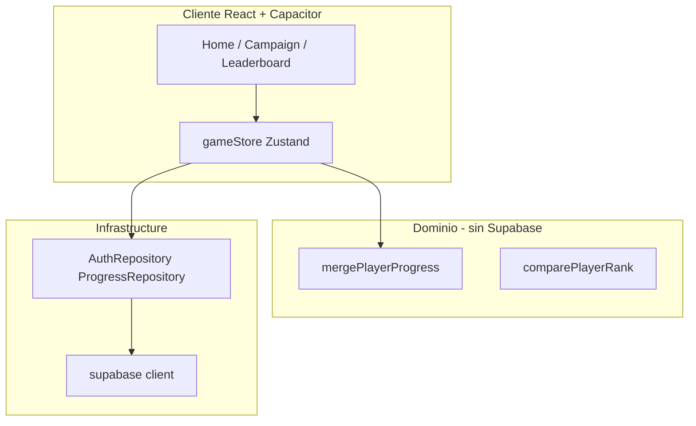

# Roadmap: funciones sociales y ranking

Plan incremental por **prompts** verificables. Cada prompt se ejecuta en el chat (ej. _"Ejecuta el Prompt 0"_), se verifica contigo y solo entonces se pasa al siguiente.

**Documentos relacionados:** [BACKEND_DECISION.md](./BACKEND_DECISION.md) · [MIGRATION_PLAYBOOK.md](./MIGRATION_PLAYBOOK.md) _(se crea en Prompt 5)_ · [EXTENSION_PLAYBOOK.md](./EXTENSION_PLAYBOOK.md)

---

## Avance general

| Prompt                                      | Versión | Descripción                               | Estado        |
| ------------------------------------------- | ------- | ----------------------------------------- | ------------- |
| [0](#prompt-0--dominio-puro)                | —       | Merge + ranking 6 criterios (sin backend) | ✅ Completado |
| [1](#prompt-1--backend-supabase)            | —       | Proyecto Supabase + esquema SQL + RLS     | ✅ Completado |
| [2](#prompt-2--capa-infrastructure)         | —       | SDK + repositories (sin UI)               | ✅ Completado |
| [3](#prompt-3--sync-offline-first)          | v1.2.0  | Sync al ganar nivel                       | ✅ Completado |
| [4](#prompt-4--ui-de-cuenta)                | v1.2.0  | Auth + Google OAuth                       | ✅ Completado |
| [5](#prompt-5--release-v120--migración-beta) | v1.2.0  | QA + Play Store + jugadores beta          | ⬜ Pendiente  |
| [6](#prompt-6--ranking-realtime)            | v1.3.0  | Leaderboard en vivo                       | ⬜ Pendiente  |

**Leyenda:** ⬜ Pendiente · 🔄 En curso · ✅ Completado

> Actualiza la columna Estado manualmente al terminar cada prompt.

---

## Principios (no negociables)

- [ ] El juego sigue **offline-first**; la nube es backup + ranking opcional
- [ ] `localStorage` (`nuts-bolts-progress`) es la fuente de verdad **durante la partida**
- [ ] Los ~20 jugadores beta **no pierden progreso** al actualizar
- [ ] El dominio (`src/domain/`) **no importa** SDK de Supabase ni ningún backend
- [ ] Ranking público solo con **opt-in** (`show_in_leaderboard`, default off)

### Regla de merge (dominio puro)

```typescript
stars = max(local, remoto);
bestMoves = min(local, remoto); // si ambos > 0
completed = local || remoto;
unlockedLevel = max(local, remoto);
```

---

## Decisiones tomadas

| Decisión          | Elección                                                 | Documento                                                                |
| ----------------- | -------------------------------------------------------- | ------------------------------------------------------------------------ |
| Backend           | **Supabase**                                             | [BACKEND_DECISION.md](./BACKEND_DECISION.md)                             |
| Auth (proveedor)  | **Supabase Auth**                                        | [BACKEND_DECISION.md](./BACKEND_DECISION.md#autenticación-supabase-auth) |
| Login principal   | **Google**                                               | Prompt 4                                                                 |
| Login alternativo | **Email + contraseña**                                   | Prompt 4                                                                 |
| Facebook          | No en v1.2 (v1.4+ si hay demanda)                        | [BACKEND_DECISION.md](./BACKEND_DECISION.md#autenticación-supabase-auth) |
| Ranking público   | Opt-in (`show_in_leaderboard`, default off)              | Prompt 6                                                                 |
| Orden del ranking | 6 criterios — ver [RANKING_RULES.md](./RANKING_RULES.md) | Prompt 0                                                                 |
| Releases          | v1.2.0 = cuenta + sync; v1.3.0 = ranking                 | —                                                                        |

---

## Cómo usar este documento

1. Di en el chat: **"Ejecuta el Prompt N"**
2. Al terminar, marca las checkboxes del prompt
3. Cambia el estado en la tabla de avance (⬜ → ✅)
4. Añade fecha en la sección **Historial** al final

---

## Prompt 0 — Dominio puro

**Comando en chat:** `Ejecuta el Prompt 0`

**Objetivo:** Lógica de merge y score sin red, sin UI, sin tocar `gameStore`.

### Qué se hace

- [x] `src/domain/progress/mergePlayerProgress.ts`
- [x] `src/domain/progress/playerRanking.ts` — `comparePlayerRank`, `deriveRankingStats`, `computeRankingPointsThrough3`, `shouldUpdateRankSnapshot`, `hasRankingStatsChanged`
- [x] Tipos en `src/domain/types.ts`: `PlayerRankingMeta`, `PlayerRankingEntry`
- [x] Tests unitarios merge + ranking (`mergePlayerProgress.test.ts`, `playerRanking.test.ts`)
- [x] Barrel `src/domain/progress/index.ts`
- [x] Reglas documentadas en [RANKING_RULES.md](./RANKING_RULES.md) (6 criterios lexicográficos; snapshot al subir `unlockedLevel`)

### Qué NO se hace

- [ ] ~~Backend / Supabase~~
- [ ] ~~Auth / pantallas nuevas~~
- [ ] ~~Cambios en `gameStore`~~

### Verificación

- [x] `npm run build` sin errores
- [x] Tests cubren: local mejor, remoto mejor, empate, nivel parcial, desempates 1→6
- [x] Revisión contigo antes de Prompt 1

### Entregable

Funciones de dominio probadas + [RANKING_RULES.md](./RANKING_RULES.md); listas para esquema Supabase (Prompt 1).

---

## Prompt 1 — Backend Supabase

**Comando en chat:** `Ejecuta el Prompt 1`

**Prerequisito:** Proyecto creado en [supabase.com](https://supabase.com) con URL + anon key.

**Objetivo:** Esquema de BD y permisos. **Sin integrar SDK en la app aún.**

### Qué se hace

- [x] Proyecto Supabase compartido (`games`) — URL + anon key en `.env.local`
- [x] Tablas: `nb_player_profiles`, `nb_player_progress`, `nb_leaderboard_events`
- [x] Columna `game_id` en todas las tablas (PK compuesta en profiles/progress)
- [x] Columnas de ranking en `nb_player_progress` — ver [RANKING_RULES.md](./RANKING_RULES.md#columnas-en-supabase-prompt-1--6):
      `completed_levels`, `total_stars`, `weighted_tier_points`, `moves_tiebreak_key`, `total_best_moves`, `rank_snapshot_at`
- [x] Payload JSON `levels` + `unlocked_level` (equivalente a `PlayerProgress` local)
- [x] Row Level Security (RLS): cada usuario solo escribe su fila; lectura pública del ranking solo con `show_in_leaderboard = true` en el mismo `game_id`
- [x] Activar **Email** provider en Supabase Dashboard (Google se configura en Prompt 4)
- [x] `.env.example` con:
  ```
  VITE_SUPABASE_URL=
  VITE_SUPABASE_ANON_KEY=
  VITE_GAME_ID=nuts-and-bolts
  VITE_FEATURE_CLOUD_SYNC=true
  VITE_FEATURE_LEADERBOARD=false
  ```
- [x] SQL guardado en `docs/supabase/schema.sql` (aplicar en SQL Editor del dashboard)
- [x] `src/config/game.ts` — `GAME_ID`, nombres de tablas para Prompt 2

### Qué NO se hace

- [ ] ~~`npm install @supabase/supabase-js` en la app~~
- [ ] ~~Cambios en componentes React~~

### Verificación

- [x] Tablas visibles en Supabase Dashboard
- [x] Usuario A no puede escribir progreso de usuario B (RLS en `schema.sql`)
- [x] Revisión contigo antes de Prompt 2

---

## Prompt 2 — Capa infrastructure

**Comando en chat:** `Ejecuta el Prompt 2`

**Objetivo:** Cliente Supabase + repositories detrás de interfaces. Sin UI visible.

### Qué se hace

- [x] `src/infrastructure/contracts/` — `AuthRepository`, `ProgressRepository`
- [x] `src/infrastructure/supabase/` — client, auth, progress (tablas `nb_*`, filtro `game_id`)
- [x] `@supabase/supabase-js` en `package.json`
- [x] Restaurar sesión al arranque (`getSession`) sin modales — `main.tsx` + `authSession.ts`
- [x] `buildMovesTiebreakKey` en dominio (columna `moves_tiebreak_key`)
- [x] Script `npm run test:supabase` — login/registro + upsert de prueba

### Verificación

- [x] Login de prueba (script `scripts/test-supabase.ts`)
- [x] Upsert de `PlayerProgress` de prueba en BD
- [x] Revisión contigo antes de Prompt 3

---

## Prompt 3 — Sync offline-first

**Comando en chat:** `Ejecuta el Prompt 3`

**Objetivo:** Sincronizar progreso al ganar nivel; merge al iniciar sesión.

### Qué se hace

- [x] `src/application/syncProgress.ts`
- [x] Suscripción en `gameStore` post-victoria vía `initProgressSync` (debounced 800 ms, retry en `online`)
- [x] Usar `hasRankingStatsChanged` para decidir upsert; `shouldUpdateRankSnapshot` para `rank_snapshot_at`
- [x] Merge automático local ↔ remoto al detectar sesión (`mergePlayerProgress`)
- [x] `replaceProgress` en `gameStore` para aplicar merge sin re-sync
- [x] Tests unitarios `syncProgress.test.ts`

### Verificación

- [x] `npm run build` y `npm test` sin errores
- [ ] Completar nivel offline → sync al reconectar (manual en dispositivo)
- [ ] Simular beta con 30+ niveles locales + login → merge correcto (manual en dispositivo)
- [x] Jugador sin cuenta sigue igual que antes (`createInfrastructure()` null si no hay flags)
- [x] Revisión contigo antes de Prompt 4

---

## Prompt 4 — UI de cuenta

**Comando en chat:** `Ejecuta el Prompt 4`

**Objetivo:** Pantallas de auth y vinculación de progreso. Google OAuth en Capacitor.

### Qué se hace

- [x] `AuthModal` — Google + email opcional
- [x] `LinkProgressModal` — one-time si `unlockedLevel > 5`
- [x] Botón "Cuenta" en Home / Settings
- [x] Deep link OAuth Android (`com.nutsandbolts.puzzle://`)
- [x] Google OAuth configurado en Supabase + Google Cloud Console (guía en `docs/supabase/README.md`)

### Verificación

- [x] Flujo completo en emulador o dispositivo real (requiere credenciales Google en Supabase)
- [x] 50 niveles locales → Google → sigue en nivel 50 con estrellas intactas (manual)
- [x] Cerrar sesión: progreso local permanece (lógica: `signOut` no toca `gameStore` / `localStorage`)
- [x] Revisión contigo antes de Prompt 5

---

## Prompt 5 — Release v1.2.0 + migración beta

**Comando en chat:** `Ejecuta el Prompt 5`

**Objetivo:** Publicar v1.2.0 en Play Store sin perder saves de los ~20 beta.

### Qué se hace

- [ ] [MIGRATION_PLAYBOOK.md](./MIGRATION_PLAYBOOK.md) — comunicación y planes A/B/C
- [ ] Export manual de save (plan B para soporte)
- [x] Bump versión en `package.json` / Android (`1.2.0`, `versionCode` 3)
- [ ] Checklist QA completo

### Checklist QA v1.2.0

- [ ] Jugador nuevo sin cuenta: juega normal
- [ ] Jugador con 30+ niveles sin cuenta: actualiza, sigue igual
- [ ] Jugador vincula Google: merge correcto
- [ ] Sin red: juega offline; sync al volver
- [ ] `npm run validate:levels` y `npm run build` OK

### Verificación

- [ ] Mensaje enviado a jugadores beta (WhatsApp/email)
- [ ] AAB subido a Play Store (o listo para subir)
- [ ] Revisión contigo antes de Prompt 6

---

## Prompt 6 — Ranking realtime

**Comando en chat:** `Ejecuta el Prompt 6`

**Versión:** v1.3.0 (release separada de v1.2.0)

**Objetivo:** Ranking global con actualizaciones en tiempo real.

### Qué se hace

- [ ] Supabase Realtime en `player_progress` / `leaderboard_events`
- [ ] `LeaderboardScreen` — top jugadores, posición propia
- [ ] Toggle opt-in "Aparecer en el ranking" (default off)
- [ ] Badge en Home con posición
- [ ] Feed reciente (últimos eventos)

### Verificación

- [ ] Dos dispositivos: uno completa nivel → otro ve cambio en <3 s
- [ ] Jugador sin opt-in no aparece en ranking
- [ ] Offline: último snapshot cacheado
- [ ] Revisión contigo → release v1.3.0

---

## Arquitectura de referencia



---

## Riesgos y mitigaciones

| Riesgo                    | Mitigación                                    |
| ------------------------- | --------------------------------------------- |
| Pérdida de save al migrar | Merge "mejor gana"; local primario en partida |
| OAuth roto en Android     | Probar en Prompt 4 antes de Play Store        |
| Hacer demasiado de golpe  | Un prompt = una verificación                  |
| Trampas en ranking        | Validación servidor + rate limit (Prompt 6)   |

---

## Historial

| Fecha      | Prompt | Notas                                                                                       |
| ---------- | ------ | ------------------------------------------------------------------------------------------- |
| 2026-07-01 | —      | Roadmap creado. Backend: Supabase.                                                          |
| 2026-07-01 | 0      | `mergePlayerProgress`, `comparePlayerRank`, vitest.                                         |
| 2026-07-01 | 0+     | Sistema de puntos acumulativos — ver [RANKING_RULES.md](./RANKING_RULES.md).                |
| 2026-07-01 | 0++    | Criterio 1 = niveles completados; snapshot solo al subir `unlockedLevel`.                   |
| 2026-07-01 | —      | Roadmap alineado con dominio (tests ranking, RANKING_RULES, columnas Prompt 1).             |
| 2026-07-01 | 1      | `docs/supabase/schema.sql` + `.env.example` con feature flags.                              |
| 2026-07-01 | 1+     | Multi-juego: tablas `nb_*` + `game_id`; `src/config/game.ts`.                               |
| 2026-07-01 | 2      | Capa infrastructure: contracts, Supabase SDK, `authSession`, `test:supabase`.               |
| 2026-07-01 | 3      | `syncProgress.ts`, merge al login, debounce post-victoria, retry offline.                   |
| 2026-07-02 | 4      | UI cuenta: `AuthModal`, `LinkProgressModal`, OAuth Capacitor, deep link Android, `useAuth`. |

---

## Próximo paso

**Prompt 5:** Release v1.2.0 + migración beta. Di: _"Ejecuta el Prompt 5"_
