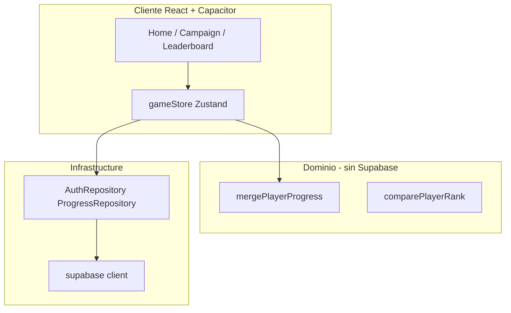

# Roadmap: funciones sociales y ranking

Plan incremental por **prompts** verificables. Cada prompt se ejecuta en el chat (ej. *"Ejecuta el Prompt 0"*), se verifica contigo y solo entonces se pasa al siguiente.

**Documentos relacionados:** [BACKEND_DECISION.md](./BACKEND_DECISION.md) · [MIGRATION_PLAYBOOK.md](./MIGRATION_PLAYBOOK.md) *(se crea en Prompt 5)* · [EXTENSION_PLAYBOOK.md](./EXTENSION_PLAYBOOK.md)

---

## Avance general

| Prompt | Versión | Descripción | Estado |
|--------|---------|-------------|--------|
| [0](#prompt-0--dominio-puro) | — | Merge de progreso + score (sin backend) | ✅ Completado |
| [1](#prompt-1--backend-supabase) | — | Proyecto Supabase + esquema SQL + RLS | ⬜ Pendiente |
| [2](#prompt-2--capa-infrastructure) | — | SDK + repositories (sin UI) | ⬜ Pendiente |
| [3](#prompt-3--sync-offline-first) | v2.0 | Sync al ganar nivel | ⬜ Pendiente |
| [4](#prompt-4--ui-de-cuenta) | v2.0 | Auth + Google OAuth | ⬜ Pendiente |
| [5](#prompt-5--release-v20--migración-beta) | v2.0 | QA + Play Store + jugadores beta | ⬜ Pendiente |
| [6](#prompt-6--ranking-realtime) | v2.1 | Leaderboard en vivo | ⬜ Pendiente |

**Leyenda:** ⬜ Pendiente · 🔄 En curso · ✅ Completado

> Actualiza la columna Estado manualmente al terminar cada prompt.

---

## Principios (no negociables)

- [ ] El juego sigue **offline-first**; la nube es backup + ranking opcional
- [ ] `localStorage` (`nuts-bolts-progress`) es la fuente de verdad **durante la partida**
- [ ] Los ~20 jugadores beta **no pierden progreso** al actualizar
- [ ] El dominio (`src/domain/`) **no importa** SDK de Supabase ni ningún backend
- [ ] Ranking público solo con **opt-in** (`show_in_leaderboard`, default off)

### Regla de merge (dominio puro)

```typescript
stars         = max(local, remoto)
bestMoves     = min(local, remoto)  // si ambos > 0
completed     = local || remoto
unlockedLevel = max(local, remoto)
```

---

## Decisiones tomadas

| Decisión | Elección | Documento |
|----------|----------|-----------|
| Backend | **Supabase** | [BACKEND_DECISION.md](./BACKEND_DECISION.md) |
| Auth (proveedor) | **Supabase Auth** | [BACKEND_DECISION.md](./BACKEND_DECISION.md#autenticación-supabase-auth) |
| Login principal | **Google** | Prompt 4 |
| Login alternativo | **Email + contraseña** | Prompt 4 |
| Facebook | No en v1 (v2.2+ si hay demanda) | [BACKEND_DECISION.md](./BACKEND_DECISION.md#autenticación-supabase-auth) |
| Ranking público | Opt-in (`show_in_leaderboard`, default off) | Prompt 6 |
| Orden del ranking | 6 criterios — ver [RANKING_RULES.md](./RANKING_RULES.md) | Prompt 0 |
| Releases | v2.0 = cuenta + sync; v2.1 = ranking | — |

---

## Cómo usar este documento

1. Di en el chat: **"Ejecuta el Prompt N"**
2. Al terminar, marca las checkboxes del prompt
3. Cambia el estado en la tabla de avance (⬜ → ✅)
4. Añade fecha en la sección **Historial** al final

---

## Prompt 0 — Dominio puro

**Comando en chat:** `Ejecuta el Prompt 0`

**Objetivo:** Lógica de merge y score sin red, sin UI, sin tocar `gameStore`.

### Qué se hace

- [x] `src/domain/progress/mergePlayerProgress.ts`
- [x] `src/domain/progress/playerRanking.ts` (`comparePlayerRank`, stats)
- [x] Tests unitarios del merge (`npm test`)
- [x] Barrel `src/domain/progress/index.ts` (tipos existentes en `types.ts`, sin cambios)

### Qué NO se hace

- [ ] ~~Backend / Supabase~~
- [ ] ~~Auth / pantallas nuevas~~
- [ ] ~~Cambios en `gameStore`~~

### Verificación

- [x] `npm run build` sin errores
- [x] Tests cubren: local mejor, remoto mejor, empate, nivel parcial
- [ ] Revisión contigo antes de Prompt 1

### Entregable

Funciones de dominio probadas, listas para cuando exista la nube.

---

## Prompt 1 — Backend Supabase

**Comando en chat:** `Ejecuta el Prompt 1`

**Prerequisito:** Proyecto creado en [supabase.com](https://supabase.com) con URL + anon key.

**Objetivo:** Esquema de BD y permisos. **Sin integrar SDK en la app aún.**

### Qué se hace

- [ ] Proyecto Supabase dedicado a Nuts & Bolts (no mezclar con otros)
- [ ] Tablas: `player_profiles`, `player_progress`, `leaderboard_events`
- [ ] Row Level Security (RLS)
- [ ] `.env.example` con `VITE_SUPABASE_URL` y `VITE_SUPABASE_ANON_KEY`
- [ ] SQL guardado en `docs/supabase/schema.sql` (o similar)

### Qué NO se hace

- [ ] ~~`npm install @supabase/supabase-js` en la app~~
- [ ] ~~Cambios en componentes React~~

### Verificación

- [ ] Tablas visibles en Supabase Dashboard
- [ ] Usuario A no puede escribir progreso de usuario B
- [ ] Revisión contigo antes de Prompt 2

---

## Prompt 2 — Capa infrastructure

**Comando en chat:** `Ejecuta el Prompt 2`

**Objetivo:** Cliente Supabase + repositories detrás de interfaces. Sin UI visible.

### Qué se hace

- [ ] `src/infrastructure/contracts/` — `AuthRepository`, `ProgressRepository`
- [ ] `src/infrastructure/supabase/` — client, auth, progress
- [ ] `@supabase/supabase-js` en `package.json`
- [ ] Restaurar sesión al arranque (`getSession`) sin modales

### Verificación

- [ ] Login de prueba (script o consola)
- [ ] Upsert de `PlayerProgress` de prueba en BD
- [ ] Revisión contigo antes de Prompt 3

---

## Prompt 3 — Sync offline-first

**Comando en chat:** `Ejecuta el Prompt 3`

**Objetivo:** Sincronizar progreso al ganar nivel; merge al iniciar sesión.

### Qué se hace

- [ ] `src/application/syncProgress.ts`
- [ ] Hook en `gameStore` post-victoria (debounced, retry sin red)
- [ ] Merge automático local ↔ remoto al detectar sesión

### Verificación

- [ ] Completar nivel offline → sync al reconectar
- [ ] Simular beta con 30+ niveles locales + login → merge correcto
- [ ] Jugador sin cuenta sigue igual que antes
- [ ] Revisión contigo antes de Prompt 4

---

## Prompt 4 — UI de cuenta

**Comando en chat:** `Ejecuta el Prompt 4`

**Objetivo:** Pantallas de auth y vinculación de progreso. Google OAuth en Capacitor.

### Qué se hace

- [ ] `AuthModal` — Google + email opcional
- [ ] `LinkProgressModal` — one-time si `unlockedLevel > 5`
- [ ] Botón "Cuenta" en Home / Settings
- [ ] Deep link OAuth Android (`com.nutsandbolts.puzzle://`)
- [ ] Google OAuth configurado en Supabase + Google Cloud Console

### Verificación

- [ ] Flujo completo en emulador o dispositivo real
- [ ] 50 niveles locales → Google → sigue en nivel 50 con estrellas intactas
- [ ] Cerrar sesión: progreso local permanece
- [ ] Revisión contigo antes de Prompt 5

---

## Prompt 5 — Release v2.0 + migración beta

**Comando en chat:** `Ejecuta el Prompt 5`

**Objetivo:** Publicar v2.0 en Play Store sin perder saves de los ~20 beta.

### Qué se hace

- [ ] [MIGRATION_PLAYBOOK.md](./MIGRATION_PLAYBOOK.md) — comunicación y planes A/B/C
- [ ] Export manual de save (plan B para soporte)
- [ ] Bump versión en `package.json` / Android
- [ ] Checklist QA completo

### Checklist QA v2.0

- [ ] Jugador nuevo sin cuenta: juega normal
- [ ] Jugador con 30+ niveles sin cuenta: actualiza, sigue igual
- [ ] Jugador vincula Google: merge correcto
- [ ] Sin red: juega offline; sync al volver
- [ ] `npm run validate:levels` y `npm run build` OK

### Verificación

- [ ] Mensaje enviado a jugadores beta (WhatsApp/email)
- [ ] AAB subido a Play Store (o listo para subir)
- [ ] Revisión contigo antes de Prompt 6

---

## Prompt 6 — Ranking realtime

**Comando en chat:** `Ejecuta el Prompt 6`

**Versión:** v2.1 (release separada de v2.0)

**Objetivo:** Ranking global con actualizaciones en tiempo real.

### Qué se hace

- [ ] Supabase Realtime en `player_progress` / `leaderboard_events`
- [ ] `LeaderboardScreen` — top jugadores, posición propia
- [ ] Toggle opt-in "Aparecer en el ranking" (default off)
- [ ] Badge en Home con posición
- [ ] Feed reciente (últimos eventos)

### Verificación

- [ ] Dos dispositivos: uno completa nivel → otro ve cambio en <3 s
- [ ] Jugador sin opt-in no aparece en ranking
- [ ] Offline: último snapshot cacheado
- [ ] Revisión contigo → release v2.1

---

## Arquitectura de referencia



---

## Riesgos y mitigaciones

| Riesgo | Mitigación |
|--------|------------|
| Pérdida de save al migrar | Merge "mejor gana"; local primario en partida |
| OAuth roto en Android | Probar en Prompt 4 antes de Play Store |
| Hacer demasiado de golpe | Un prompt = una verificación |
| Trampas en ranking | Validación servidor + rate limit (Prompt 6) |

---

## Historial

| Fecha | Prompt | Notas |
|-------|--------|-------|
| 2026-07-01 | — | Roadmap creado. Backend: Supabase. |
| 2026-07-01 | 0 | `mergePlayerProgress`, `comparePlayerRank`, vitest. |
| 2026-07-01 | 0+ | Sistema de puntos acumulativos — ver [RANKING_RULES.md](./RANKING_RULES.md). |
| 2026-07-01 | 0++ | Criterio 1 = niveles completados; snapshot solo al subir `unlockedLevel`. |

---

## Próximo paso

**Prompt 1** — Crea proyecto en [supabase.com](https://supabase.com) y di: *"Ejecuta el Prompt 1"*
